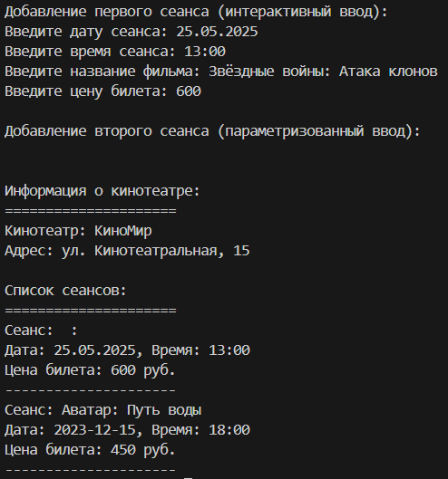

# Лабораторная работа №1
## Тема: "Создание классов и объектов"
Выполнил: Торубаров М. Е.
Курс: 2
Группа: ПИЖ-б-0-23-2
## Задача:
1. Создать приложение согласно выбранному варианту.
2. В приложении должно быть описано 2 класса (основной и допол-нительный), в каждом из которых должны быть закрытые (private) данные и открытые (public) методы.
3. Хотя бы в одном из классов должно быть несколько методов с оди-наковыми именами, но с разным набором параметров для инициализации сразу нескольких атрибутов класса.
4. При этом в основном классе должен быть массив объектов допол-нительного класса.
5. Для добавления в этот массив должен использоваться метод, кото-рому в параметрах должен передаваться объект дополнительного класса.
6. В теле основной программы необходимо создать объект основного класса, заполнить его данными через методы, заполнить массив объектами дополнительного класса, вывести содержимое основного объекта, включая весь массив дополнительных объектов
## Вариант 4
Тема проекта: приложение «Касса кинотеатра».
В приложении должно быть реализовано 2 класса: Кинотеатр и Се-анс. Класс Кинотеатр содержит название, адрес. Класс Сеанс содержит дату, время, название.
## Листинг кода
```cpp
#include <iostream>
#include <string>
#include <vector>
using namespace std;

class Session { // Дополнительный класс
private:
    string date;
    string time;
    string movieTitle;
    double ticketPrice;

public:
    // Геттеры
    string getDate() { return date; }
    string getTime() { return time; }
    string getMovieTitle() { return movieTitle; }
    double getTicketPrice() { return ticketPrice; }

    // Сеттеры
    void setDate(string d) { date = d; }
    void setTime(string t) { time = t; }
    void setMovieTitle(string mt) { movieTitle = mt; }
    void setTicketPrice(double p) { ticketPrice = p; }

    // Перегруженные методы
    void setProperties() {
        cout << "Введите дату сеанса: ";
        getline(cin, date);
        cout << "Введите время сеанса: ";
        getline(cin, time);
        cout << "Введите название фильма: ";
        getline(cin, movieTitle);
        cout << "Введите цену билета: ";
        cin >> ticketPrice;
        cin.ignore(); // Очистка буфера
    }

    void setProperties(string d, string t, string mt, double p) {
        date = d;
        time = t;
        movieTitle = mt;
        ticketPrice = p;
    }

    void displayInfo() {
        cout << "Сеанс: " << movieTitle << endl;
        cout << "Дата: " << date << ", Время: " << time << endl;
        cout << "Цена билета: " << ticketPrice << " руб." << endl;
        cout << "---------------------" << endl;
    }
};

class Cinema { // Основной класс
private:
    string name;
    string address;
    vector<Session> sessions; // Массив объектов Session

public:
    // Геттеры
    string getName() { return name; }
    string getAddress() { return address; }

    // Сеттеры
    void setName(string n) { name = n; }
    void setAddress(string a) { address = a; }

    // Метод для добавления сеанса
    void addSession(Session s) {
        sessions.push_back(s);
    }

    // Метод для отображения информации о кинотеатре
    void displayInfo() {
        cout << "Кинотеатр: " << name << endl;
        cout << "Адрес: " << address << endl << endl;
        cout << "Список сеансов:" << endl;
        cout << "=====================" << endl;
        
        for (size_t i = 0; i < sessions.size(); ++i) {
            sessions[i].displayInfo();
        }
    }
};

int main() {
    Cinema myCinema;
    
    // Установка информации о кинотеатре
    myCinema.setName("КиноМир");
    myCinema.setAddress("ул. Кинотеатральная, 15");

    // Добавление сеансов разными способами
    Session s1;
    cout << "Добавление первого сеанса (интерактивный ввод):" << endl;
    s1.setProperties();
    myCinema.addSession(s1);

    Session s2;
    cout << "\nДобавление второго сеанса (параметризованный ввод):" << endl;
    s2.setProperties("2023-12-15", "18:00", "Аватар: Путь воды", 450.0);
    myCinema.addSession(s2);

    // Вывод всей информации
    cout << "\n\nИнформация о кинотеатре:" << endl;
    cout << "=====================" << endl;
    myCinema.displayInfo();

    return 0;
}
```
## Пример работы программы


## Описание алгоритма
Класс Session представляет собой сеанс в кинотеатре и содержит информацию о дате, времени, названии фильма и цене билета. В классе определены геттеры и сеттеры для этих полей, а также два метода setProperties(): один для интерактивного ввода данных, другой для установки свойств сеанса с помощью параметров. Метод displayInfo() выводит информацию о сеансе на экран.

Класс Cinema представляет собой кинотеатр и содержит информацию о его названии и адресе. В классе определены геттеры и сеттеры для этих полей, а также метод addSession(), который добавляет сеанс в список сеансов кинотеатра. Метод displayInfo() выводит информацию о кинотеатре и всех его сеансах на экран.

В функции main() создается объект класса Cinema, устанавливаются его свойства, добавляются два сеанса разными способами (интерактивный ввод и параметризованный ввод), и затем выводится вся информация о кинотеатре и его сеансах.