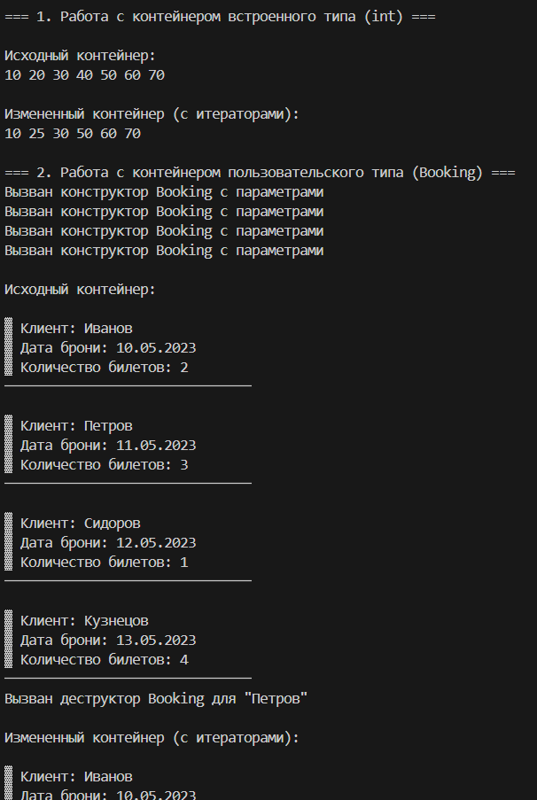
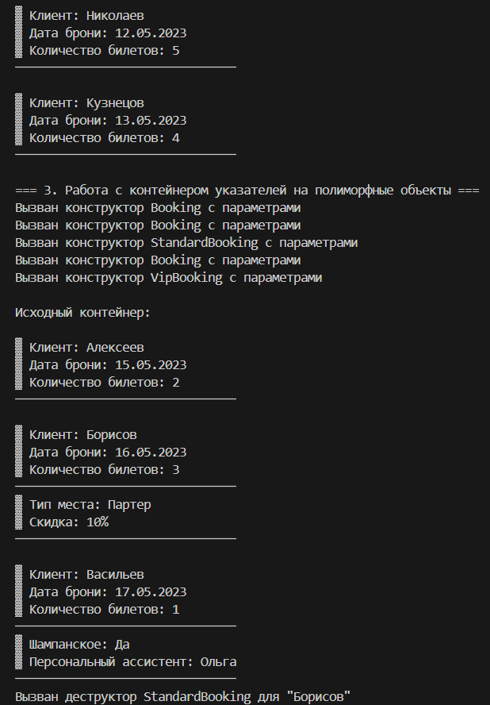
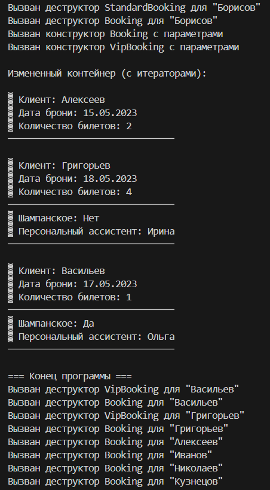

# Лабораторная работа №10
## Тема: "Контейнер"
Выполнил: Торубаров М. Е.
Курс: 2
Группа: ПИЖ-б-0-23-2
## Задача:
1. Дополнить и при необходимости модифицировать приложение, разработанное согласно варианту лабораторной работы № 3.
2. Создать объект-контейнер в соответствии с вариантом задания и за-полнить его данными, тип которых определяется вариантом задания.
3. Просмотреть контейнер.
4. Изменить контейнер, удалив из него одни элементы и изменив другие.
5. Просмотреть контейнер, используя для доступа к его элементам итераторы.
6. То же самое повторить для данных пользовательского типа.
## Листинг кода
```cpp
#include <iostream>
#include <string>
#include <vector>
#include <iomanip>
#include <memory>
#include <algorithm>
#include <list>
#include <set>

using namespace std;

// Базовый класс Бронирование
class Booking {
protected:
    string clientName;
    string bookingDate;
    int ticketCount;

public:
    Booking() : clientName("Не указано"), bookingDate("01.01.2023"), ticketCount(0) {
        cout << "Вызван конструктор Booking без параметров\n";
    }

    Booking(string name, string date, int count) 
        : clientName(name), bookingDate(date), ticketCount(count) {
        cout << "Вызван конструктор Booking с параметрами\n";
    }

    virtual ~Booking() {
        cout << "Вызван деструктор Booking для \"" << clientName << "\"\n";
    }

    virtual void display() const {
        cout << "\n▓ Клиент: " << clientName
             << "\n▓ Дата брони: " << bookingDate
             << "\n▓ Количество билетов: " << ticketCount
             << "\n───────────────────────────────\n";
    }

    virtual void input() {
        cout << "Введите имя клиента: ";
        getline(cin, clientName);
        cout << "Введите дату брони (ДД.ММ.ГГГГ): ";
        getline(cin, bookingDate);
        cout << "Введите количество билетов: ";
        cin >> ticketCount;
        cin.ignore();
    }

    // Для сравнения объектов (нужно для set)
    bool operator<(const Booking& other) const {
        return clientName < other.clientName;
    }

    // Для изменения данных
    void setTicketCount(int count) { ticketCount = count; }
    void setClientName(const string& name) { clientName = name; }
};

// Класс-наследник 1: Стандартное бронирование
class StandardBooking : public Booking {
private:
    string seatType;
    double discount;

public:
    StandardBooking() : Booking(), seatType("Обычный"), discount(0) {
        cout << "Вызван конструктор StandardBooking без параметров\n";
    }

    StandardBooking(string name, string date, int count, string seat, double disc) 
        : Booking(name, date, count), seatType(seat), discount(disc) {
        cout << "Вызван конструктор StandardBooking с параметрами\n";
    }

    ~StandardBooking() override {
        cout << "Вызван деструктор StandardBooking для \"" << clientName << "\"\n";
    }

    void display() const override {
        Booking::display();
        cout << "▓ Тип места: " << seatType
             << "\n▓ Скидка: " << discount * 100 << "%"
             << "\n───────────────────────────────\n";
    }

    void input() override {
        Booking::input();
        cout << "Введите тип места: ";
        getline(cin, seatType);
        cout << "Введите размер скидки (0-1): ";
        cin >> discount;
        cin.ignore();
    }

    // Для изменения данных
    void setSeatType(const string& type) { seatType = type; }
    void setDiscount(double disc) { discount = disc; }
};

// Класс-наследник 2: VIP бронирование
class VipBooking : public Booking {
private:
    bool hasChampagne;
    string personalAssistant;

public:
    VipBooking() : Booking(), hasChampagne(false), personalAssistant("Не назначен") {
        cout << "Вызван конструктор VipBooking без параметров\n";
    }

    VipBooking(string name, string date, int count, bool champagne, string assistant) 
        : Booking(name, date, count), hasChampagne(champagne), personalAssistant(assistant) {
        cout << "Вызван конструктор VipBooking с параметрами\n";
    }

    ~VipBooking() override {
        cout << "Вызван деструктор VipBooking для \"" << clientName << "\"\n";
    }

    void display() const override {
        Booking::display();
        cout << "▓ Шампанское: " << (hasChampagne ? "Да" : "Нет")
             << "\n▓ Персональный ассистент: " << personalAssistant
             << "\n───────────────────────────────\n";
    }

    void input() override {
        Booking::input();
        cout << "Будет шампанское? (1 - да, 0 - нет): ";
        cin >> hasChampagne;
        cin.ignore();
        cout << "Введите имя ассистента: ";
        getline(cin, personalAssistant);
    }

    // Для изменения данных
    void setChampagne(bool champagne) { hasChampagne = champagne; }
    void setAssistant(const string& assistant) { personalAssistant = assistant; }
};

// Функция для вывода контейнера с использованием итераторов
template<typename Container>
void printContainer(const Container& container) {
    for (auto it = container.begin(); it != container.end(); ++it) {
        it->display();
    }
}

// Функция для вывода контейнера указателей с использованием итераторов
template<typename Container>
void printPointerContainer(const Container& container) {
    for (auto it = container.begin(); it != container.end(); ++it) {
        (*it)->display();
    }
}

int main() {
    setlocale(LC_ALL, "Russian");

    // 1. Создание и заполнение контейнера (вектор) встроенного типа (int)
    cout << "=== 1. Работа с контейнером встроенного типа (int) ===" << endl;
    
    vector<int> numbers = {10, 20, 30, 40, 50, 60, 70};
    
    // 2. Просмотр контейнера
    cout << "\nИсходный контейнер:" << endl;
    for (const auto& num : numbers) {
        cout << num << " ";
    }
    cout << endl;
    
    // 3. Изменение контейнера
    numbers.erase(remove(numbers.begin(), numbers.end(), 40), numbers.end()); // Удаляем 40
    numbers[1] = 25; // Изменяем второй элемент
    
    // 4. Просмотр с использованием итераторов
    cout << "\nИзмененный контейнер (с итераторами):" << endl;
    for (auto it = numbers.begin(); it != numbers.end(); ++it) {
        cout << *it << " ";
    }
    cout << endl;

    // 5. То же самое для пользовательского типа (Booking)
    cout << "\n=== 2. Работа с контейнером пользовательского типа (Booking) ===" << endl;
    
    list<Booking> bookingsList;
    bookingsList.emplace_back("Иванов", "10.05.2023", 2);
    bookingsList.emplace_back("Петров", "11.05.2023", 3);
    bookingsList.emplace_back("Сидоров", "12.05.2023", 1);
    bookingsList.emplace_back("Кузнецов", "13.05.2023", 4);
    
    // 2. Просмотр контейнера
    cout << "\nИсходный контейнер:" << endl;
    printContainer(bookingsList);
    
    // 3. Изменение контейнера
    auto it = bookingsList.begin();
    advance(it, 1); // Переходим ко второму элементу
    bookingsList.erase(it); // Удаляем второй элемент
    
    it = bookingsList.begin();
    advance(it, 1); // Теперь это второй элемент (бывший третий)
    it->setTicketCount(5); // Изменяем количество билетов
    it->setClientName("Николаев"); // Изменяем имя клиента
    
    // 4. Просмотр с использованием итераторов
    cout << "\nИзмененный контейнер (с итераторами):" << endl;
    printContainer(bookingsList);

    // 6. Работа с контейнером указателей на полиморфные объекты
    cout << "\n=== 3. Работа с контейнером указателей на полиморфные объекты ===" << endl;
    
    set<unique_ptr<Booking>> bookingSet;
    bookingSet.insert(make_unique<Booking>("Алексеев", "15.05.2023", 2));
    bookingSet.insert(make_unique<StandardBooking>("Борисов", "16.05.2023", 3, "Партер", 0.1));
    bookingSet.insert(make_unique<VipBooking>("Васильев", "17.05.2023", 1, true, "Ольга"));
    
    // 2. Просмотр контейнера
    cout << "\nИсходный контейнер:" << endl;
    printPointerContainer(bookingSet);
    
    // 3. Изменение контейнера
    auto setIt = bookingSet.begin();
    advance(setIt, 1); // Переходим ко второму элементу
    bookingSet.erase(setIt); // Удаляем второй элемент
    
    // Изменяем первый элемент
    auto firstIt = bookingSet.begin();
    if (auto standard = dynamic_cast<StandardBooking*>((*firstIt).get())) {
        standard->setSeatType("Балкон");
        standard->setDiscount(0.15);
    }
    
    // Добавляем новый элемент
    bookingSet.insert(make_unique<VipBooking>("Григорьев", "18.05.2023", 4, false, "Ирина"));
    
    // 4. Просмотр с использованием итераторов
    cout << "\nИзмененный контейнер (с итераторами):" << endl;
    printPointerContainer(bookingSet);

    cout << "\n=== Конец программы ===" << endl;
    return 0;
}
```
## Пример работы программы




## Описание алгоритма
В этом коде реализован алгоритм работы с сеансами кинотеатра. Класс Session является базовым классом для всех сеансов, а классы StandardSession и VipSession являются его наследниками. Класс Session содержит информацию о фильме, времени сеанса и количестве доступных мест. Классы StandardSession и VipSession добавляют дополнительную информацию о типе зала и цене билета для стандартного сеанса, а также о наличии бара и имени хостес для VIP сеанса. В классе Session также реализованы методы для работы с файлами, а именно сохранения и загрузки данных о сеансе. В функции main демонстрируется работа операторов ввода/вывода и сохранения/загрузки данных о сеансах.