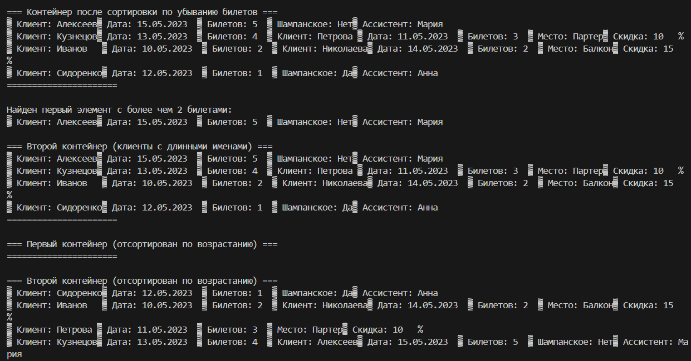

# Лабораторная работа №11
## Тема: "Алгоритмы"
Выполнил: Торубаров М. Е.
Курс: 2
Группа: ПИЖ-б-0-23-2
## Задача:
1. Дополнить и при необходимости модифицировать приложение, раз-работанное согласно варианту лабораторной работы № 3.
2. Создать контейнер, содержащий объекты пользовательского типа. Тип контейнера выбирается в соответствии с вариантом задания.
3. Отсортировать его по убыванию элементов.
4. Просмотреть контейнер.
5. Используя подходящий алгоритм, найти в контейнере элемент, удовлетворяющий заданному условию.
6. Переместить элементы, удовлетворяющие заданному условию в дру-гой (предварительно пустой) контейнер. Тип второго контейнера определя-ется вариантом задания.
7. Просмотреть второй контейнер.
8. Отсортировать первый и второй контейнеры по возрастанию элементов.
9. Просмотреть их.
## Листинг кода
```cpp
#include <iostream>
#include <string>
#include <vector>
#include <iomanip>
#include <memory>
#include <algorithm>
#include <list>
#include <set>

using namespace std;

// Базовый класс Бронирование
class Booking {
protected:
    string clientName;
    string bookingDate;
    int ticketCount;

public:
    Booking() : clientName("Не указано"), bookingDate("01.01.2023"), ticketCount(0) {}

    Booking(string name, string date, int count) 
        : clientName(name), bookingDate(date), ticketCount(count) {}

    virtual ~Booking() {}

    virtual void display() const {
        cout << "▓ Клиент: " << left << setw(15) << clientName
             << "▓ Дата: " << setw(12) << bookingDate
             << "▓ Билетов: " << setw(3) << ticketCount;
    }

    bool operator>(const Booking& other) const {
        return ticketCount > other.ticketCount;
    }

    bool operator<(const Booking& other) const {
        return ticketCount < other.ticketCount;
    }

    bool hasLongName() const {
        return clientName.length() > 5;
    }

    bool hasManyTickets() const {
        return ticketCount > 2;
    }

    string getClientName() const { return clientName; }
    int getTicketCount() const { return ticketCount; }
};

// Класс-наследник 1: Стандартное бронирование
class StandardBooking : public Booking {
private:
    string seatType;
    double discount;

public:
    StandardBooking(string name, string date, int count, string seat, double disc) 
        : Booking(name, date, count), seatType(seat), discount(disc) {}

    void display() const override {
        Booking::display();
        cout << "▓ Место: " << setw(10) << seatType
             << "▓ Скидка: " << setw(5) << discount * 100 << "%\n";
    }
};

// Класс-наследник 2: VIP бронирование
class VipBooking : public Booking {
private:
    bool hasChampagne;
    string personalAssistant;

public:
    VipBooking(string name, string date, int count, bool champagne, string assistant) 
        : Booking(name, date, count), hasChampagne(champagne), personalAssistant(assistant) {}

    void display() const override {
        Booking::display();
        cout << "▓ Шампанское: " << setw(3) << (hasChampagne ? "Да" : "Нет")
             << "▓ Ассистент: " << personalAssistant << "\n";
    }
};

template<typename Container>
void printContainer(const string& title, const Container& container) {
    cout << "\n=== " << title << " ===\n";
    for (const auto& item : container) {
        item->display();
    }
    cout << "======================\n";
}

int main() {
    setlocale(LC_ALL, "Russian");

    // 1. Создаем контейнер vector с объектами пользовательского типа
    vector<unique_ptr<Booking>> bookings;

    // Заполняем контейнер
    bookings.push_back(make_unique<Booking>("Иванов", "10.05.2023", 2));
    bookings.push_back(make_unique<StandardBooking>("Петрова", "11.05.2023", 3, "Партер", 0.1));
    bookings.push_back(make_unique<VipBooking>("Сидоренко", "12.05.2023", 1, true, "Анна"));
    bookings.push_back(make_unique<Booking>("Кузнецов", "13.05.2023", 4));
    bookings.push_back(make_unique<StandardBooking>("Николаева", "14.05.2023", 2, "Балкон", 0.15));
    bookings.push_back(make_unique<VipBooking>("Алексеев", "15.05.2023", 5, false, "Мария"));

    // 2. Сортируем по убыванию количества билетов
    sort(bookings.begin(), bookings.end(), 
        [](const unique_ptr<Booking>& a, const unique_ptr<Booking>& b) {
            return *a > *b;
        });

    // 3. Просматриваем контейнер после сортировки
    printContainer("Контейнер после сортировки по убыванию билетов", bookings);

    // 4. Ищем элементы с количеством билетов > 2
    auto it = find_if(bookings.begin(), bookings.end(),
        [](const unique_ptr<Booking>& b) {
            return b->getTicketCount() > 2;
        });

    if (it != bookings.end()) {
        cout << "\nНайден первый элемент с более чем 2 билетами:\n";
        (*it)->display();
    }

    // 5. Создаем второй контейнер list и перемещаем элементы с длинными именами
    list<unique_ptr<Booking>> longNameBookings;

    for (auto it = bookings.begin(); it != bookings.end(); ) {
        if ((*it)->hasLongName()) {
            longNameBookings.push_back(move(*it));
            it = bookings.erase(it);
        } else {
            ++it;
        }
    }

    // 6. Просматриваем второй контейнер
    printContainer("Второй контейнер (клиенты с длинными именами)", longNameBookings);

    // 7. Сортируем оба контейнера по возрастанию количества билетов
    sort(bookings.begin(), bookings.end(),
        [](const unique_ptr<Booking>& a, const unique_ptr<Booking>& b) {
            return *a < *b;
        });

    longNameBookings.sort(
        [](const unique_ptr<Booking>& a, const unique_ptr<Booking>& b) {
            return *a < *b;
        });

    // 8. Просматриваем отсортированные контейнеры
    printContainer("Первый контейнер (отсортирован по возрастанию)", bookings);
    printContainer("Второй контейнер (отсортирован по возрастанию)", longNameBookings);

    return 0;
}
```
## Пример работы программы


## Описание алгоритма
Этот код представляет собой программу, которая моделирует систему бронирования билетов. В программе определены два класса-наследника StandardBooking и VipBooking, которые наследуются от базового класса Booking. Каждый класс имеет свои уникальные свойства и методы.

В функции main создается вектор bookings, который заполняется объектами классов Booking, StandardBooking и VipBooking. Затем вектор сортируется по убыванию количества билетов. После этого программа ищет первый элемент с количеством билетов больше 2 и выводит его на экран.

Далее создается второй контейнер longNameBookings типа list, в который перемещаются элементы из bookings, у которых длина имени клиента больше 5 символов. Затем оба контейнера сортируются по возрастанию количества билетов и выводятся на экран.

В целом, программа демонстрирует работу с контейнерами, наследованием, сортировкой и поиском элементов в контейнерах.