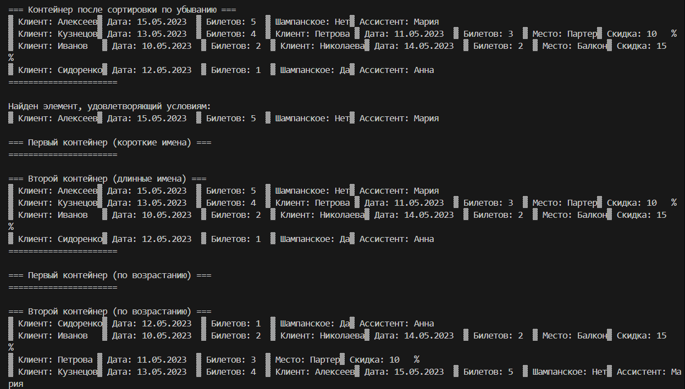

# Лабораторная работа №12
## Тема: "Лямбда-функции"
Выполнил: Торубаров М. Е.
Курс: 2
Группа: ПИЖ-б-0-23-2
## Задача:
1. Дополнить и при необходимости модифицировать приложение, разработанное согласно варианту лабораторной работы № 11.
2. Для алгоритмов, используемых в лабораторной работе № 11 ис-пользовать не глобальные функции, а лямбда-функции.
## Листинг кода
```cpp
#include <iostream>
#include <string>
#include <vector>
#include <iomanip>
#include <memory>
#include <algorithm>
#include <list>

using namespace std;

class Booking {
protected:
    string clientName;
    string bookingDate;
    int ticketCount;

public:
    Booking() : clientName("Не указано"), bookingDate("01.01.2023"), ticketCount(0) {}

    Booking(string name, string date, int count) 
        : clientName(name), bookingDate(date), ticketCount(count) {}

    virtual ~Booking() {}

    virtual void display() const {
        cout << "▓ Клиент: " << left << setw(15) << clientName
             << "▓ Дата: " << setw(12) << bookingDate
             << "▓ Билетов: " << setw(3) << ticketCount;
    }

    string getClientName() const { return clientName; }
    int getTicketCount() const { return ticketCount; }
};

class StandardBooking : public Booking {
private:
    string seatType;
    double discount;

public:
    StandardBooking(string name, string date, int count, string seat, double disc) 
        : Booking(name, date, count), seatType(seat), discount(disc) {}

    void display() const override {
        Booking::display();
        cout << "▓ Место: " << setw(10) << seatType
             << "▓ Скидка: " << setw(5) << discount * 100 << "%\n";
    }
};

class VipBooking : public Booking {
private:
    bool hasChampagne;
    string personalAssistant;

public:
    VipBooking(string name, string date, int count, bool champagne, string assistant) 
        : Booking(name, date, count), hasChampagne(champagne), personalAssistant(assistant) {}

    void display() const override {
        Booking::display();
        cout << "▓ Шампанское: " << setw(3) << (hasChampagne ? "Да" : "Нет")
             << "▓ Ассистент: " << personalAssistant << "\n";
    }
};

int main() {
    setlocale(LC_ALL, "Russian");

    // 1. Создаем и заполняем контейнер
    vector<unique_ptr<Booking>> bookings;
    bookings.push_back(make_unique<Booking>("Иванов", "10.05.2023", 2));
    bookings.push_back(make_unique<StandardBooking>("Петрова", "11.05.2023", 3, "Партер", 0.1));
    bookings.push_back(make_unique<VipBooking>("Сидоренко", "12.05.2023", 1, true, "Анна"));
    bookings.push_back(make_unique<Booking>("Кузнецов", "13.05.2023", 4));
    bookings.push_back(make_unique<StandardBooking>("Николаева", "14.05.2023", 2, "Балкон", 0.15));
    bookings.push_back(make_unique<VipBooking>("Алексеев", "15.05.2023", 5, false, "Мария"));

    // 2. Сортируем по убыванию (лямбда)
    sort(bookings.begin(), bookings.end(), 
        [](const unique_ptr<Booking>& a, const unique_ptr<Booking>& b) {
            return a->getTicketCount() > b->getTicketCount();
        });

    // 3. Просмотр (лямбда)
    auto printContainer = [](const string& title, const auto& container) {
        cout << "\n=== " << title << " ===\n";
        for_each(container.begin(), container.end(), 
            [](const auto& item) { item->display(); });
        cout << "======================\n";
    };

    printContainer("Контейнер после сортировки по убыванию", bookings);

    // 4. Поиск элемента (лямбда)
    auto found = find_if(bookings.begin(), bookings.end(),
        [](const unique_ptr<Booking>& b) {
            return b->getTicketCount() > 2 && b->getClientName().length() > 5;
        });

    if (found != bookings.end()) {
        cout << "\nНайден элемент, удовлетворяющий условиям:\n";
        (*found)->display();
    }

    // 5. Перемещение во второй контейнер (лямбда)
    list<unique_ptr<Booking>> longNameBookings;
    auto it = partition(bookings.begin(), bookings.end(),
        [](const unique_ptr<Booking>& b) {
            return b->getClientName().length() <= 5;
        });

    transform(it, bookings.end(), back_inserter(longNameBookings),
        [](unique_ptr<Booking>& b) {
            return move(b);
        });

    bookings.erase(it, bookings.end());

    printContainer("Первый контейнер (короткие имена)", bookings);
    printContainer("Второй контейнер (длинные имена)", longNameBookings);

    // 6. Сортировка по возрастанию (лямбда)
    auto ascComparator = [](const unique_ptr<Booking>& a, const unique_ptr<Booking>& b) {
        return a->getTicketCount() < b->getTicketCount();
    };

    sort(bookings.begin(), bookings.end(), ascComparator);
    longNameBookings.sort(ascComparator);

    printContainer("Первый контейнер (по возрастанию)", bookings);
    printContainer("Второй контейнер (по возрастанию)", longNameBookings);

    return 0;
}
```
## Пример работы программы


## Описание алгоритма
Этот код представляет собой программу, которая моделирует систему бронирования билетов. В программе определены два класса-наследника StandardBooking и VipBooking, которые наследуются от базового класса Booking. Каждый класс имеет свои уникальные свойства и методы.

В функции main создается вектор bookings, который заполняется объектами классов Booking, StandardBooking и VipBooking. Затем вектор сортируется по убыванию количества билетов с использованием лямбда-функции в качестве компаратора.

Далее определяется лямбда-функция printContainer, которая используется для вывода содержимого контейнера на экран. Эта функция принимает заголовок и контейнер в качестве аргументов и выводит содержимое контейнера на экран.

Затем программа ищет первый элемент с количеством билетов больше 2 и длиной имени клиента больше 5 символов с использованием лямбда-функции в качестве предиката для функции find_if. Если такой элемент найден, он выводится на экран.

Далее создается второй контейнер longNameBookings типа list, в который перемещаются элементы из bookings, у которых длина имени клиента больше 5 символов. Для этого используется лямбда-функция в качестве предиката для функции partition и лямбда-функция в качестве операции преобразования для функции transform.

Затем оба контейнера сортируются по возрастанию количества билетов с использованием лямбда-функции в качестве компаратора. После этого оба контейнера выводятся на экран с использованием функции printContainer.

В целом, программа демонстрирует работу с контейнерами, наследованием, сортировкой, поиском элементов в контейнерах и перемещением элементов из одного контейнера в другой, а также использование лямбда-функций в качестве компараторов, предикатов и операций преобразования.