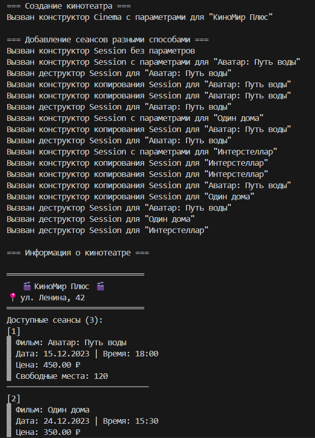
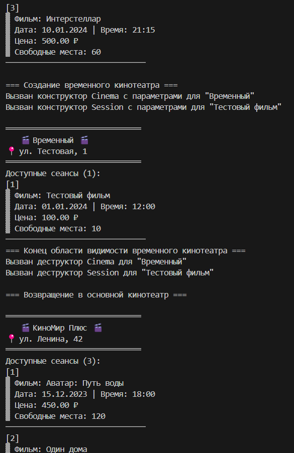
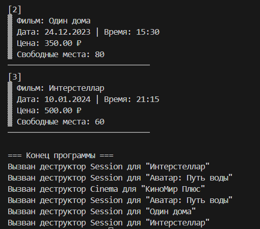

# Лабораторная работа №2
## Тема: "Конструкторы и деструкторы"
Выполнил: Торубаров М. Е.
Курс: 2
Группа: ПИЖ-б-0-23-2
## Задача:
1. Дополнить и при необходимости модифицировать приложение, разработанное согласно варианту лабораторной работы № 1.
2. Определить в классах следующие конструкторы: без параметров, с параметрами, копирования.
3. Определить в классе деструктор.
4. В каждом конструкторе и деструкторе выдавать сообщение, пока-зывающее, какой именно конструктор или деструктор был вызван.
5. Дополнить основной класс методом с параметрами, внутри которого должен создаваться объект дополнительного класса с помощью конструктора с параметрами и добавляться в массив объектов дополнительного класса.
6. Дополнить основной класс методом с двумя параметрами (ссылка на объект дополнительного класса и количество), внутри которого должны создаваться объекты дополнительного класса с помощью конструктора ко-пирования (создается необходимое количество копий указанного объекта) и заноситься в массив объектов дополнительного класса.
7. Дополнить/модифицировать основное тело программы таким обра-зом, чтобы продемонстрировать использование всех конструкторов.
## Вариант 4
Тема проекта: приложение «Касса кинотеатра».
В приложении должно быть реализовано 2 класса: Кинотеатр и Се-анс. Класс Кинотеатр содержит название, адрес. Класс Сеанс содержит дату, время, название.
## Листинг кода
```cpp
#include <iostream>
#include <string>
#include <vector>
#include <iomanip>

using namespace std;

class Session {
private:
    string movieTitle;
    string date;
    string time;
    double ticketPrice;
    int seatsAvailable;

public:
    // Конструктор без параметров
    Session() : movieTitle("Не указано"), date("01.01.1970"), time("00:00"), ticketPrice(0), seatsAvailable(0) {
        cout << "Вызван конструктор Session без параметров\n";
    }

    // Конструктор с параметрами
    Session(string title, string d, string t, double price, int seats)
        : movieTitle(title), date(d), time(t), ticketPrice(price), seatsAvailable(seats) {
        cout << "Вызван конструктор Session с параметрами для \"" << title << "\"\n";
    }

    // Конструктор копирования
    Session(const Session& other)
        : movieTitle(other.movieTitle), date(other.date), time(other.time),
        ticketPrice(other.ticketPrice), seatsAvailable(other.seatsAvailable) {
        cout << "Вызван конструктор копирования Session для \"" << movieTitle << "\"\n";
    }

    // Деструктор
    ~Session() {
        cout << "Вызван деструктор Session для \"" << movieTitle << "\"\n";
    }

    void display() const {
        cout << "\n▓ Фильм: " << movieTitle
            << "\n▓ Дата: " << date << " | Время: " << time
            << "\n▓ Цена: " << fixed << setprecision(2) << ticketPrice << " ₽"
            << "\n▓ Свободные места: " << seatsAvailable
            << "\n───────────────────────────────\n";
    }

    string getMovieTitle() const { return movieTitle; }
    double getTicketPrice() const { return ticketPrice; }
    int getSeatsAvailable() const { return seatsAvailable; }

    bool bookSeat() {
        if (seatsAvailable > 0) {
            seatsAvailable--;
            return true;
        }
        return false;
    }
};

class Cinema {
private:
    string name;
    string address;
    vector<Session> sessions;

public:
    // Конструкторы
    Cinema() : name("Не указано"), address("Не указано") {
        cout << "Вызван конструктор Cinema без параметров\n";
    }

    Cinema(string n, string addr) : name(n), address(addr) {
        cout << "Вызван конструктор Cinema с параметрами для \"" << n << "\"\n";
    }

    // Конструктор копирования
    Cinema(const Cinema& other) : name(other.name), address(other.address), sessions(other.sessions) {
        cout << "Вызван конструктор копирования Cinema для \"" << name << "\"\n";
    }

    // Деструктор
    ~Cinema() {
        cout << "Вызван деструктор Cinema для \"" << name << "\"\n";
    }

    // Новый метод: добавление сеанса через конструктор с параметрами
    void addSessionWithParams(string title, string date, string time, double price, int seats) {
        sessions.emplace_back(title, date, time, price, seats);
    }

    // Новый метод: добавление нескольких копий сеанса
    void addCopiesOfSession(const Session& session, int count) {
        for (int i = 0; i < count; ++i) {
            sessions.push_back(Session(session)); // Используем конструктор копирования
        }
    }

    void displayAll() const {
        cout << "\n══════════════════════════════"
            << "\n   🎬 " << name << " 🎬"
            << "\n📍 " << address
            << "\n══════════════════════════════\n";

        if (sessions.empty()) {
            cout << "Нет доступных сеансов.\n";
        }
        else {
            cout << "Доступные сеансы (" << sessions.size() << "):\n";
            for (size_t i = 0; i < sessions.size(); ++i) {
                cout << "[" << i + 1 << "]";
                sessions[i].display();
            }
        }
    }

    void bookTicket(int sessionIndex) {
        if (sessionIndex >= 0 && sessionIndex < sessions.size()) {
            if (sessions[sessionIndex].bookSeat()) {
                cout << "✅ Билет забронирован на \""
                    << sessions[sessionIndex].getMovieTitle() << "\"\n";
            }
            else {
                cout << "❌ Мест нет!\n";
            }
        }
        else {
            cout << "❌ Неверный номер сеанса!\n";
        }
    }
};

int main() {
    setlocale(LC_ALL, "Russian");

    cout << "=== Создание кинотеатра ===" << endl;
    Cinema cinema("КиноМир Плюс", "ул. Ленина, 42");

    cout << "\n=== Добавление сеансов разными способами ===" << endl;

    // 1. Создание через конструктор без параметров + ручное заполнение
    Session s1;
    s1 = Session("Аватар: Путь воды", "15.12.2023", "18:00", 450.0, 120);
    cinema.addCopiesOfSession(s1, 1); // Добавим 2 копии

    // 2. Создание через конструктор с параметрами
    cinema.addSessionWithParams("Один дома", "24.12.2023", "15:30", 350.0, 80);

    // 3. Создание через конструктор копирования
    Session s2("Интерстеллар", "10.01.2024", "21:15", 500.0, 60);
    cinema.addCopiesOfSession(s2, 1);

    cout << "\n=== Информация о кинотеатре ===" << endl;
    cinema.displayAll();

    // Создадим временный объект для демонстрации деструктора
    {
        cout << "\n=== Создание временного кинотеатра ===" << endl;
        Cinema tempCinema("Временный", "ул. Тестовая, 1");
        tempCinema.addSessionWithParams("Тестовый фильм", "01.01.2024", "12:00", 100.0, 10);
        tempCinema.displayAll();
        cout << "=== Конец области видимости временного кинотеатра ===" << endl;
    }

    cout << "\n=== Возвращение в основной кинотеатр ===" << endl;
    cinema.displayAll();

    cout << "\n=== Конец программы ===" << endl;
    return 0;
}
```
## Пример работы программы




## Описание алгоритма
Программа представляет собой пример работы с классами в C++. В ней определены два класса: Session и Cinema.

Класс Session представляет собой сеанс в кинотеатре и содержит информацию о названии фильма, дате, времени, цене билета и количестве доступных мест. В классе определены конструкторы без параметров, с параметрами и копирования, а также деструктор. Метод display() выводит информацию о сеансе на экран. Метод bookSeat() позволяет забронировать место на сеансе, если они есть.

Класс Cinema представляет собой кинотеатр и содержит информацию о его названии, адресе и векторе сеансов. В классе определены конструкторы без параметров, с параметрами и копирования, а также деструктор. Метод addSessionWithParams() позволяет добавить сеанс в список сеансов кинотеатра с помощью параметров. Метод addCopiesOfSession() добавляет несколько копий сеанса в список сеансов кинотеатра. Метод displayAll() выводит информацию о кинотеатре и всех его сеансах на экран. Метод bookTicket() позволяет забронировать место на сеансе по его индексу.

В функции main() создается объект класса Cinema, устанавливаются его свойства, добавляются сеансы разными способами (через конструктор без параметров, с параметрами и копирования), и затем выводится вся информация о кинотеатре и его сеансах. Также создается временный объект класса Cinema для демонстрации работы деструктора.