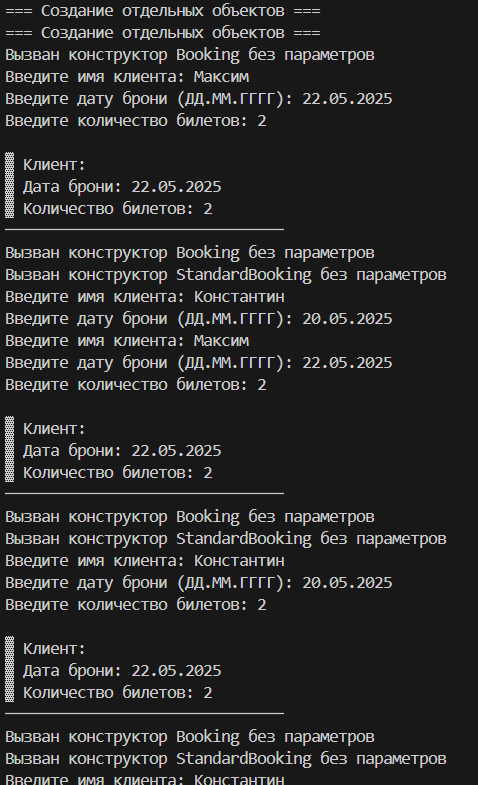
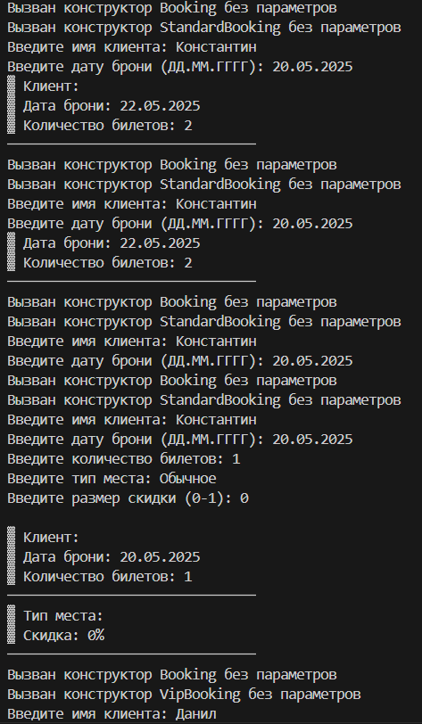
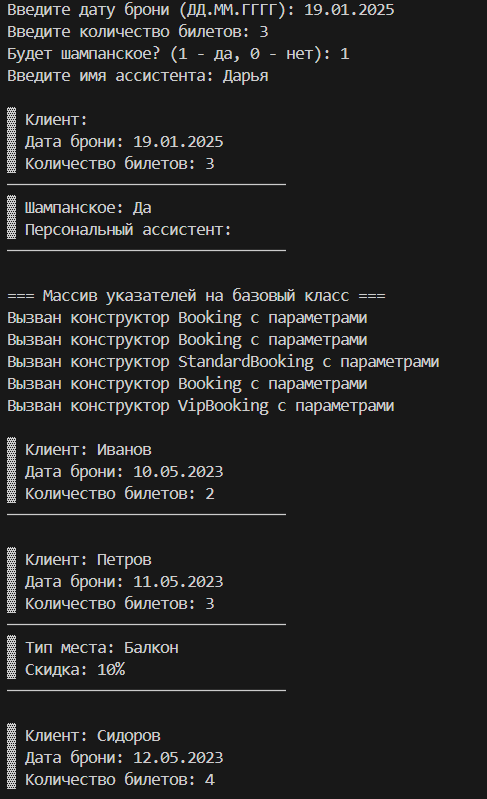
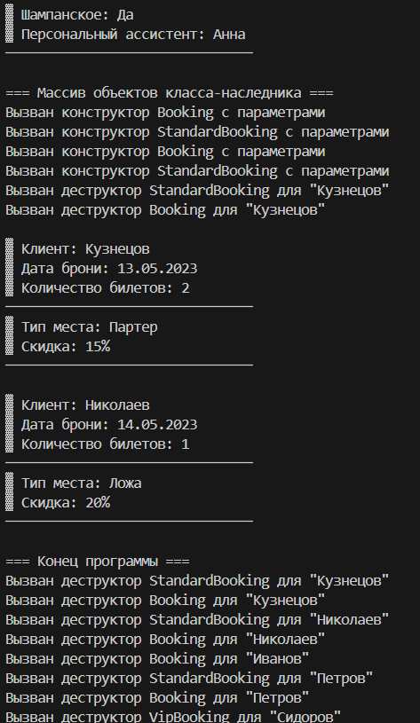

# Лабораторная работа №3
## Тема: "Наследование"
Выполнил: Торубаров М. Е.
Курс: 2
Группа: ПИЖ-б-0-23-2
## Задача:
1. Дополнить и при необходимости модифицировать приложение, разработанное согласно варианту лабораторной работы № 2.
2. Создать несколько классов-наследников для дополнительного класса (т. е. дополнительный класс станет базовым для новых создаваемых клас-сов). Каждый класс-наследник должен включать в себя атрибуты, отличаю-щие его от других классов.
3. Определить в новых классах конструкторы и деструктор.
4. В каждом конструкторе и деструкторе выдавать сообщение, показы-вающее, какой именно конструктор или деструктор и какого класса был вызван.
5. Определить в новых классах методы для ввода и вывода данных как самого класса-наследника, так и базового класса. Метод вывода данных должен иметь то же имя, что и метод вывода данных в базовом классе.
6. Дополнить основное тело программы созданием объектов базо-вого класса, объектов классов-наследников, инициализацией данных и вы-водом на экран этих объектов без занесения их в массив объектов в основ-ном классе из лабораторной работы № 1 (в этой работе данный класс не за-действован).
7. Создать массив объектов, тип массива – базовый класс. Поместить в массив как объекты базового, так и объекты классов-наследников.
8. В цикле пройти по всем элементам созданного в п. 7 массива, вы-звать метод вывода данных на экран.
9. Создать массив объектов. Тип массива – один из классов-наслед-ников. Поместить в массив объекты этого класса-наследника.
10. В цикле пройти по всем элементам созданного в п. 9 массива, вы-звать метод вывода данных на экран.
## Вариант 4
Тема проекта: приложение Касса кинотеатра.
Добавить классы: Бронирование, Оплаченные билеты.
## Листинг кода
```cpp
#include <iostream>
#include <string>
#include <vector>
#include <iomanip>
#include <memory>

using namespace std;

// Базовый класс Бронирование
class Booking {
protected:
    string clientName;
    string bookingDate;
    int ticketCount;

public:
    Booking() : clientName("Не указано"), bookingDate("01.01.2023"), ticketCount(0) {
        cout << "Вызван конструктор Booking без параметров\n";
    }

    Booking(string name, string date, int count) 
        : clientName(name), bookingDate(date), ticketCount(count) {
        cout << "Вызван конструктор Booking с параметрами\n";
    }

    virtual ~Booking() {
        cout << "Вызван деструктор Booking для \"" << clientName << "\"\n";
    }

    virtual void display() const {
        cout << "\n▓ Клиент: " << clientName
             << "\n▓ Дата брони: " << bookingDate
             << "\n▓ Количество билетов: " << ticketCount
             << "\n───────────────────────────────\n";
    }

    virtual void input() {
        cout << "Введите имя клиента: ";
        getline(cin, clientName);
        cout << "Введите дату брони (ДД.ММ.ГГГГ): ";
        getline(cin, bookingDate);
        cout << "Введите количество билетов: ";
        cin >> ticketCount;
        cin.ignore();
    }
};

// Класс-наследник 1: Стандартное бронирование
class StandardBooking : public Booking {
private:
    string seatType;
    double discount;

public:
    StandardBooking() : Booking(), seatType("Обычный"), discount(0) {
        cout << "Вызван конструктор StandardBooking без параметров\n";
    }

    StandardBooking(string name, string date, int count, string seat, double disc) 
        : Booking(name, date, count), seatType(seat), discount(disc) {
        cout << "Вызван конструктор StandardBooking с параметрами\n";
    }

    ~StandardBooking() override {
        cout << "Вызван деструктор StandardBooking для \"" << clientName << "\"\n";
    }

    void display() const override {
        Booking::display();
        cout << "▓ Тип места: " << seatType
             << "\n▓ Скидка: " << discount * 100 << "%"
             << "\n───────────────────────────────\n";
    }

    void input() override {
        Booking::input();
        cout << "Введите тип места: ";
        getline(cin, seatType);
        cout << "Введите размер скидки (0-1): ";
        cin >> discount;
        cin.ignore();
    }
};

// Класс-наследник 2: VIP бронирование
class VipBooking : public Booking {
private:
    bool hasChampagne;
    string personalAssistant;

public:
    VipBooking() : Booking(), hasChampagne(false), personalAssistant("Не назначен") {
        cout << "Вызван конструктор VipBooking без параметров\n";
    }

    VipBooking(string name, string date, int count, bool champagne, string assistant) 
        : Booking(name, date, count), hasChampagne(champagne), personalAssistant(assistant) {
        cout << "Вызван конструктор VipBooking с параметрами\n";
    }

    ~VipBooking() override {
        cout << "Вызван деструктор VipBooking для \"" << clientName << "\"\n";
    }

    void display() const override {
        Booking::display();
        cout << "▓ Шампанское: " << (hasChampagne ? "Да" : "Нет")
             << "\n▓ Персональный ассистент: " << personalAssistant
             << "\n───────────────────────────────\n";
    }

    void input() override {
        Booking::input();
        cout << "Будет шампанское? (1 - да, 0 - нет): ";
        cin >> hasChampagne;
        cin.ignore();
        cout << "Введите имя ассистента: ";
        getline(cin, personalAssistant);
    }
};

int main() {
    setlocale(LC_ALL, "Russian");

    cout << "=== Создание отдельных объектов ===" << endl;
    
    // Создаем объект базового класса
    Booking baseBooking;
    baseBooking.input();
    baseBooking.display();

    // Создаем объект класса-наследника StandardBooking
    StandardBooking standard;
    standard.input();
    standard.display();

    // Создаем объект класса-наследника VipBooking
    VipBooking vip;
    vip.input();
    vip.display();

    cout << "\n=== Массив указателей на базовый класс ===" << endl;
    vector<unique_ptr<Booking>> bookings;
    
    // Добавляем объекты разных типов
    bookings.push_back(make_unique<Booking>("Иванов", "10.05.2023", 2));
    bookings.push_back(make_unique<StandardBooking>("Петров", "11.05.2023", 3, "Балкон", 0.1));
    bookings.push_back(make_unique<VipBooking>("Сидоров", "12.05.2023", 4, true, "Анна"));

    // Выводим через массив базового класса
    for (const auto& booking : bookings) {
        booking->display();
    }

    cout << "\n=== Массив объектов класса-наследника ===" << endl;
    vector<StandardBooking> standardBookings;
    standardBookings.emplace_back("Кузнецов", "13.05.2023", 2, "Партер", 0.15);
    standardBookings.emplace_back("Николаев", "14.05.2023", 1, "Ложа", 0.2);

    // Выводим через массив класса-наследника
    for (const auto& booking : standardBookings) {
        booking.display();
    }

    cout << "\n=== Конец программы ===" << endl;
    return 0;
}
```
## Пример работы программы





## Описание алгоритма
Программа представляет собой программу на языке C++, которая моделирует систему бронирования билетов. В программе определены три класса: Booking, StandardBooking и VipBooking.

Класс Booking является базовым классом, который содержит информацию о клиенте, дате бронирования и количестве билетов. Он также имеет методы для ввода и вывода этой информации.

Классы StandardBooking и VipBooking являются наследниками класса Booking. Они добавляют дополнительные поля и методы, специфичные для каждого типа бронирования. Например, класс StandardBooking содержит информацию о типе места и размере скидки, а класс VipBooking содержит информацию о наличии шампанского и имени персонального ассистента.

В функции main создается несколько объектов каждого типа и выводится информация о них. Затем создается вектор указателей на объекты базового класса Booking, в который добавляются объекты разных типов. Вектор позволяет хранить объекты разных типов, но при этом обращаться к ним через указатели на базовый класс. Это демонстрирует полиморфизм - возможность использовать объекты разных типов через общий интерфейс.

Далее создается вектор объектов класса StandardBooking и выводится информация о них. Это демонстрирует, что можно создавать и использовать векторы объектов конкретного класса, а не только указателей на базовый класс.

В конце программы выводится сообщение о ее завершении.