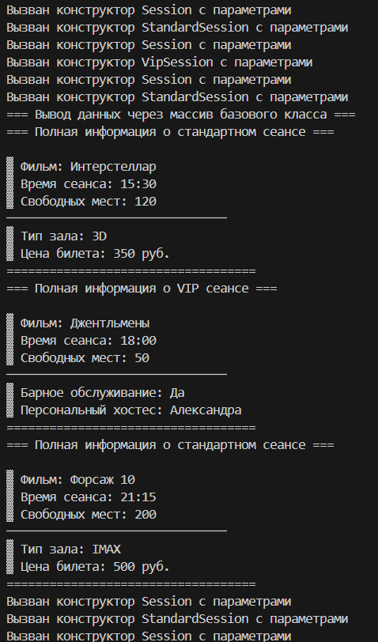
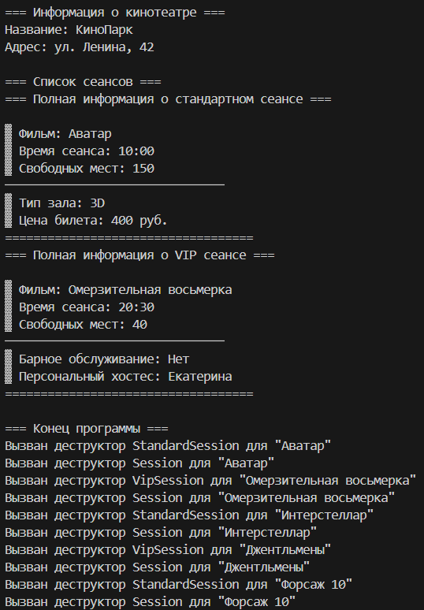

# Лабораторная работа №4
## Тема: "Полиморфизм и виртуальные методы"
Выполнил: Торубаров М. Е.
Курс: 2
Группа: ПИЖ-б-0-23-2
## Задача:
1. Дополнить и при необходимости модифицировать приложение, разработанное согласно варианту лабораторной работы № 3.
2. Определить в базовом классе (он же дополнительный класс из ла-бораторной работы № 1) чисто виртуальную функцию.
3. Перегрузить в классах-наследниках (классы, созданные в лабора-торной работе № 3) виртуальную функцию: реализовать вывод всех данных как базового класса, так и класса-наследника.
4. В основном теле программы создать массив объектов, тип массива – базовый класс. Поместить в массив объекты всех классов-наследников.
5. В цикле пройти по всем элементам созданного в п. 4 массива, вы-звать метод вывода данных на экран. Сравнить с результатом лабораторной работы № 3.
6. Модифицировать основной класс (из лабораторной работы № 1) таким образом, чтобы его внутренний массив мог содержать объекты любых классов-наследников (из лабораторной № 3), и добавить метод вывода всех данных (включая массив) на экран.
7. В основном теле программы продемонстрировать работу с объек-том основного класса.
## Вариант 4
Тема проекта: приложение Касса кинотеатра.
Добавить классы: Бронирование, Оплаченные билеты.
## Листинг кода
```cpp
#include <iostream>
#include <string>
#include <vector>
#include <iomanip>
#include <memory>

using namespace std;

// Базовый класс Сеанс (дополнительный класс)
class Session {
protected:
    string movieName;
    string sessionTime;
    int availableSeats;

public:
    Session() : movieName("Не указано"), sessionTime("12:00"), availableSeats(0) {
        cout << "Вызван конструктор Session без параметров\n";
    }

    Session(string name, string time, int seats) 
        : movieName(name), sessionTime(time), availableSeats(seats) {
        cout << "Вызван конструктор Session с параметрами\n";
    }

    virtual ~Session() {
        cout << "Вызван деструктор Session для \"" << movieName << "\"\n";
    }

    virtual void display() const {
        cout << "\n▓ Фильм: " << movieName
             << "\n▓ Время сеанса: " << sessionTime
             << "\n▓ Свободных мест: " << availableSeats
             << "\n───────────────────────────────\n";
    }

    virtual void input() {
        cout << "Введите название фильма: ";
        getline(cin, movieName);
        cout << "Введите время сеанса (ЧЧ:ММ): ";
        getline(cin, sessionTime);
        cout << "Введите количество свободных мест: ";
        cin >> availableSeats;
        cin.ignore();
    }

    // Чисто виртуальная функция
    virtual void showFullInfo() const = 0;
};

// Класс-наследник 1: Стандартный сеанс
class StandardSession : public Session {
private:
    string hallType;
    double ticketPrice;

public:
    StandardSession() : Session(), hallType("Обычный"), ticketPrice(0) {
        cout << "Вызван конструктор StandardSession без параметров\n";
    }

    StandardSession(string name, string time, int seats, string hall, double price) 
        : Session(name, time, seats), hallType(hall), ticketPrice(price) {
        cout << "Вызван конструктор StandardSession с параметрами\n";
    }

    ~StandardSession() override {
        cout << "Вызван деструктор StandardSession для \"" << movieName << "\"\n";
    }

    void display() const override {
        Session::display();
        cout << "▓ Тип зала: " << hallType
             << "\n▓ Цена билета: " << ticketPrice << " руб."
             << "\n───────────────────────────────\n";
    }

    void input() override {
        Session::input();
        cout << "Введите тип зала: ";
        getline(cin, hallType);
        cout << "Введите цену билета: ";
        cin >> ticketPrice;
        cin.ignore();
    }

    void showFullInfo() const override {
        cout << "=== Полная информация о стандартном сеансе ===" << endl;
        Session::display();
        cout << "▓ Тип зала: " << hallType << endl;
        cout << "▓ Цена билета: " << ticketPrice << " руб." << endl;
        cout << "===================================" << endl;
    }
};

// Класс-наследник 2: VIP сеанс
class VipSession : public Session {
private:
    bool hasBarService;
    string personalHost;

public:
    VipSession() : Session(), hasBarService(false), personalHost("Не назначен") {
        cout << "Вызван конструктор VipSession без параметров\n";
    }

    VipSession(string name, string time, int seats, bool bar, string host) 
        : Session(name, time, seats), hasBarService(bar), personalHost(host) {
        cout << "Вызван конструктор VipSession с параметрами\n";
    }

    ~VipSession() override {
        cout << "Вызван деструктор VipSession для \"" << movieName << "\"\n";
    }

    void display() const override {
        Session::display();
        cout << "▓ Барное обслуживание: " << (hasBarService ? "Да" : "Нет")
             << "\n▓ Персональный хостес: " << personalHost
             << "\n───────────────────────────────\n";
    }

    void input() override {
        Session::input();
        cout << "Будет барное обслуживание? (1 - да, 0 - нет): ";
        cin >> hasBarService;
        cin.ignore();
        cout << "Введите имя хостеса: ";
        getline(cin, personalHost);
    }

    void showFullInfo() const override {
        cout << "=== Полная информация о VIP сеансе ===" << endl;
        Session::display();
        cout << "▓ Барное обслуживание: " << (hasBarService ? "Да" : "Нет") << endl;
        cout << "▓ Персональный хостес: " << personalHost << endl;
        cout << "===================================" << endl;
    }
};

// Основной класс Cinema
class Cinema {
private:
    string name;
    string address;
    vector<unique_ptr<Session>> sessions; // Массив для хранения сеансов

public:
    Cinema() : name("Не указано"), address("Не указано") {}
    Cinema(string n, string addr) : name(n), address(addr) {}

    void addSession(unique_ptr<Session> session) {
        sessions.push_back(move(session));
    }

    // Метод для вывода всех данных
    void showAllInfo() const {
        cout << "\n=== Информация о кинотеатре ===" << endl;
        cout << "Название: " << name << endl;
        cout << "Адрес: " << address << endl;
        cout << "\n=== Список сеансов ===" << endl;
        
        for (const auto& session : sessions) {
            session->showFullInfo();
        }
    }
};

int main() {
    setlocale(LC_ALL, "Russian");

    // Создаем массив объектов базового класса
    vector<unique_ptr<Session>> sessionsArray;
    
    // Добавляем объекты разных типов
    sessionsArray.push_back(make_unique<StandardSession>("Интерстеллар", "15:30", 120, "3D", 350.0));
    sessionsArray.push_back(make_unique<VipSession>("Джентльмены", "18:00", 50, true, "Александра"));
    sessionsArray.push_back(make_unique<StandardSession>("Форсаж 10", "21:15", 200, "IMAX", 500.0));

    // Выводим данные через массив базового класса
    cout << "=== Вывод данных через массив базового класса ===" << endl;
    for (const auto& session : sessionsArray) {
        session->showFullInfo();
    }

    // Демонстрация работы с основным классом Cinema
    Cinema cinema("КиноПарк", "ул. Ленина, 42");
    
    // Добавляем сеансы в кинотеатр
    cinema.addSession(make_unique<StandardSession>("Аватар", "10:00", 150, "3D", 400.0));
    cinema.addSession(make_unique<VipSession>("Омерзительная восьмерка", "20:30", 40, false, "Екатерина"));
    
    // Выводим полную информацию о кинотеатре
    cinema.showAllInfo();

    cout << "\n=== Конец программы ===" << endl;
    return 0;
}
```
## Пример работы программы



## Описание алгоритма
Определяем базовый класс Session с полями movieName, sessionTime и availableSeats. В классе есть конструкторы, деструктор, методы display(), input() и чисто виртуальный метод showFullInfo().

Определяем классы-наследники StandardSession и VipSession, которые наследуются от Session. В этих классах добавлены дополнительные поля и переопределены методы display(), input() и showFullInfo().

Определяем основной класс Cinema с полями name, address и вектором sessions для хранения сеансов. В классе есть методы addSession() и showAllInfo().

В функции main() создаем вектор sessionsArray и добавляем в него объекты разных типов (StandardSession и VipSession). Затем выводим данные через массив базового класса.

Создаем объект cinema класса Cinema и добавляем в него сеансы. Выводим полную информацию о кинотеатре.

В конце программы выводим сообщение "Конец программы".