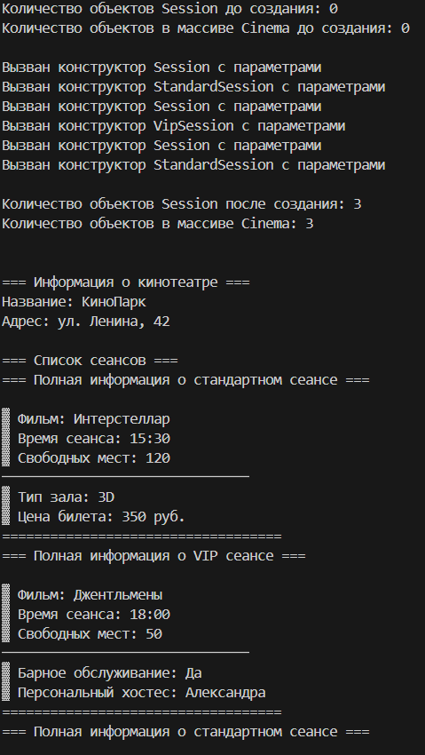
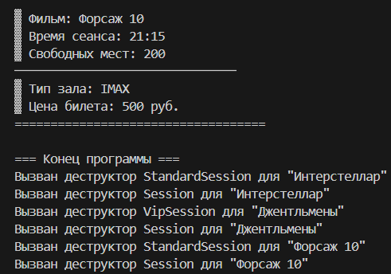

# Лабораторная работа №5
## Тема: "Статические члены класса"
Выполнил: Торубаров М. Е.
Курс: 2
Группа: ПИЖ-б-0-23-2
## Задача:
1. Дополнить и при необходимости модифицировать приложение, разработанное согласно варианту лабораторной работы № 4.
2. Определить в базовом классе закрытый (private) статический счетчик объектов.
3. Определить статический метод для получения информации о количестве созданных объектов.
4. Модифицировать конструкторы и деструкторы базового класса: увеличивать счетчик в конструкторе и уменьшать в деструкторе.
5. В основном классе определить закрытый статический счетчик объектов, помещенных во внутренний массив и соответствующий ему метод для получения информации о количестве объектов в массиве.
6. В основном теле программы вывести количество объектов, не создавая ни одного объекта базового класса или классов-наследников.
7. Создать объекты классов-наследников и поместить их во внутренний массив объекта основного класса.
8. Снова вывести количество созданных объектов и количество объектов во внутреннем массиве объекта основного класса.
## Листинг кода
```cpp
#include <iostream>
#include <string>
#include <vector>
#include <iomanip>
#include <memory>

using namespace std;

// Базовый класс Сеанс (дополнительный класс)
class Session {
protected:
    string movieName;
    string sessionTime;
    int availableSeats;
    
private:
    static int objectCount; // Статический счетчик объектов 

public:
    Session() : movieName("Не указано"), sessionTime("12:00"), availableSeats(0) {
        objectCount++; // Увеличиваем счетчик в конструкторе 
        cout << "Вызван конструктор Session без параметров\n";
    }

    Session(string name, string time, int seats) 
        : movieName(name), sessionTime(time), availableSeats(seats) {
        objectCount++; // Увеличиваем счетчик в конструкторе 
        cout << "Вызван конструктор Session с параметрами\n";
    }

    virtual ~Session() {
        objectCount--; // Уменьшаем счетчик в деструкторе 
        cout << "Вызван деструктор Session для \"" << movieName << "\"\n";
    }

    // Статический метод для получения количества объектов 
    static int getObjectCount() {
        return objectCount;
    }

    virtual void display() const {
        cout << "\n▓ Фильм: " << movieName
             << "\n▓ Время сеанса: " << sessionTime
             << "\n▓ Свободных мест: " << availableSeats
             << "\n───────────────────────────────\n";
    }

    virtual void input() {
        cout << "Введите название фильма: ";
        getline(cin, movieName);
        cout << "Введите время сеанса (ЧЧ:ММ): ";
        getline(cin, sessionTime);
        cout << "Введите количество свободных мест: ";
        cin >> availableSeats;
        cin.ignore();
    }

    virtual void showFullInfo() const = 0;
};

// Инициализация статического счетчика
int Session::objectCount = 0;

// Класс-наследник 1: Стандартный сеанс
class StandardSession : public Session {
private:
    string hallType;
    double ticketPrice;

public:
    StandardSession() : Session(), hallType("Обычный"), ticketPrice(0) {
        cout << "Вызван конструктор StandardSession без параметров\n";
    }

    StandardSession(string name, string time, int seats, string hall, double price) 
        : Session(name, time, seats), hallType(hall), ticketPrice(price) {
        cout << "Вызван конструктор StandardSession с параметрами\n";
    }

    ~StandardSession() override {
        cout << "Вызван деструктор StandardSession для \"" << movieName << "\"\n";
    }

    void display() const override {
        Session::display();
        cout << "▓ Тип зала: " << hallType
             << "\n▓ Цена билета: " << ticketPrice << " руб."
             << "\n───────────────────────────────\n";
    }

    void input() override {
        Session::input();
        cout << "Введите тип зала: ";
        getline(cin, hallType);
        cout << "Введите цену билета: ";
        cin >> ticketPrice;
        cin.ignore();
    }

    void showFullInfo() const override {
        cout << "=== Полная информация о стандартном сеансе ===" << endl;
        Session::display();
        cout << "▓ Тип зала: " << hallType << endl;
        cout << "▓ Цена билета: " << ticketPrice << " руб." << endl;
        cout << "===================================" << endl;
    }
};

// Класс-наследник 2: VIP сеанс
class VipSession : public Session {
private:
    bool hasBarService;
    string personalHost;

public:
    VipSession() : Session(), hasBarService(false), personalHost("Не назначен") {
        cout << "Вызван конструктор VipSession без параметров\n";
    }

    VipSession(string name, string time, int seats, bool bar, string host) 
        : Session(name, time, seats), hasBarService(bar), personalHost(host) {
        cout << "Вызван конструктор VipSession с параметрами\n";
    }

    ~VipSession() override {
        cout << "Вызван деструктор VipSession для \"" << movieName << "\"\n";
    }

    void display() const override {
        Session::display();
        cout << "▓ Барное обслуживание: " << (hasBarService ? "Да" : "Нет")
             << "\n▓ Персональный хостес: " << personalHost
             << "\n───────────────────────────────\n";
    }

    void input() override {
        Session::input();
        cout << "Будет барное обслуживание? (1 - да, 0 - нет): ";
        cin >> hasBarService;
        cin.ignore();
        cout << "Введите имя хостеса: ";
        getline(cin, personalHost);
    }

    void showFullInfo() const override {
        cout << "=== Полная информация о VIP сеансе ===" << endl;
        Session::display();
        cout << "▓ Барное обслуживание: " << (hasBarService ? "Да" : "Нет") << endl;
        cout << "▓ Персональный хостес: " << personalHost << endl;
        cout << "===================================" << endl;
    }
};

// Основной класс Cinema
class Cinema {
private:
    string name;
    string address;
    vector<unique_ptr<Session>> sessions;
    
    static int arrayObjectCount; // Счетчик объектов в массиве 

public:
    Cinema() : name("Не указано"), address("Не указано") {}
    Cinema(string n, string addr) : name(n), address(addr) {}

    void addSession(unique_ptr<Session> session) {
        sessions.push_back(move(session));
        arrayObjectCount++; // Увеличиваем счетчик при добавлении 
    }

    // Статический метод для получения количества объектов в массиве 
    static int getArrayObjectCount() {
        return arrayObjectCount;
    }

    void showAllInfo() const {
        cout << "\n=== Информация о кинотеатре ===" << endl;
        cout << "Название: " << name << endl;
        cout << "Адрес: " << address << endl;
        cout << "\n=== Список сеансов ===" << endl;
        
        for (const auto& session : sessions) {
            session->showFullInfo();
        }
    }
};

// Инициализация статического счетчика
int Cinema::arrayObjectCount = 0;

int main() {
    setlocale(LC_ALL, "Russian");

    // Пункт 6: Вывод количества объектов до создания 
    cout << "Количество объектов Session до создания: " << Session::getObjectCount() << endl;
    cout << "Количество объектов в массиве Cinema до создания: " << Cinema::getArrayObjectCount() << endl << endl;

    // Пункт 7: Создание объектов и добавление в массив
    Cinema cinema("КиноПарк", "ул. Ленина, 42");
    
    // Создаем объекты классов-наследников
    auto session1 = make_unique<StandardSession>("Интерстеллар", "15:30", 120, "3D", 350.0);
    auto session2 = make_unique<VipSession>("Джентльмены", "18:00", 50, true, "Александра");
    auto session3 = make_unique<StandardSession>("Форсаж 10", "21:15", 200, "IMAX", 500.0);
    
    // Добавляем в массив
    cinema.addSession(move(session1));
    cinema.addSession(move(session2));
    cinema.addSession(move(session3));

    // Пункт 8: Вывод количества после создания
    cout << "\nКоличество объектов Session после создания: " << Session::getObjectCount() << endl;
    cout << "Количество объектов в массиве Cinema: " << Cinema::getArrayObjectCount() << endl << endl;

    // Выводим информацию о кинотеатре
    cinema.showAllInfo();

    cout << "\n=== Конец программы ===" << endl;
    return 0;
}
```
## Пример работы программы



## Описание алгоритма
В классе Session есть статический член objectCount, который увеличивается при создании нового объекта и уменьшается при его удалении. Это позволяет отслеживать общее количество созданных объектов класса Session и его наследников. Статический метод getObjectCount возвращает текущее значение objectCount.

В классе Cinema также есть статический член arrayObjectCount, который увеличивается при добавлении нового сеанса в список сеансов кинотеатра. Это позволяет отслеживать количество сеансов, добавленных в кинотеатр. Статический метод getArrayObjectCount возвращает текущее значение arrayObjectCount.

В функции main эти статические члены используются для вывода количества созданных объектов и сеансов до и после создания объектов и добавления их в кинотеатр.