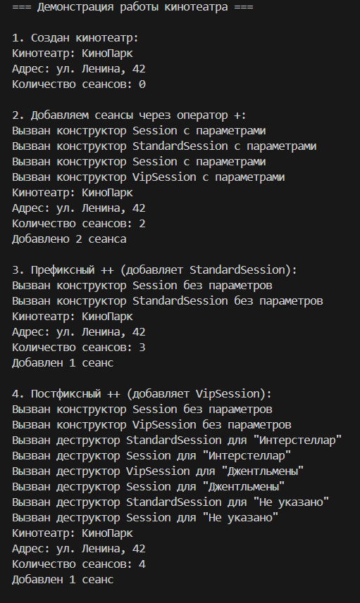
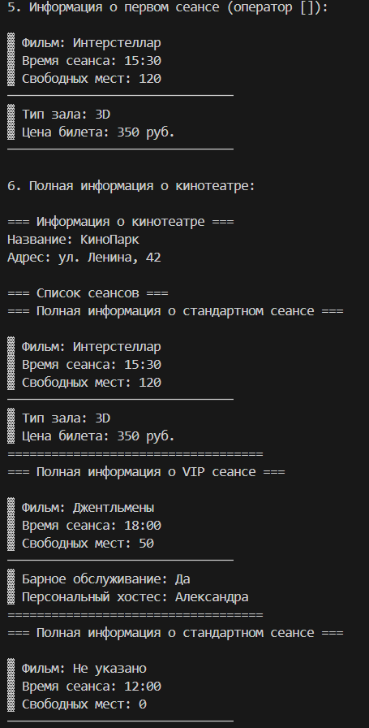
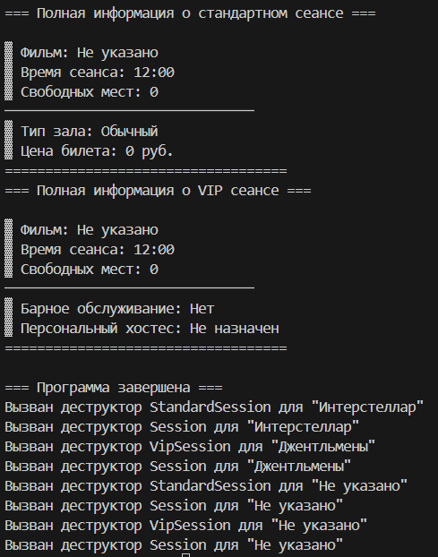

# Лабораторная работа №6
## Тема: "Перегрузка операторов"
Выполнил: Торубаров М. Е.
Курс: 2
Группа: ПИЖ-б-0-23-2
## Задача:
1. Дополнить и при необходимости модифицировать приложение, раз-работанное согласно варианту лабораторной работы № 5.
2. Определить в основном классе оператор + для добавления объекта одного из классов-наследников во внутренний массив.
3. Определить в основном классе операторы ++ префиксный и пост-фиксный для добавления объектов по умолчанию в массив (созданных с по-мощью конструктора по умолчанию).
4. Определить в основном классе оператор [] для доступа к эле-менту массива по индексу.
5. Определить глобальный оператор << для вывода данных на экран.
6. В основном теле программы продемонстрировать применение всех операторов.
## Листинг кода
```cpp
#include <iostream>
#include <string>
#include <vector>
#include <iomanip>
#include <memory>

using namespace std;

// Базовый класс Сеанс (дополнительный класс)
class Session {
protected:
    string movieName;
    string sessionTime;
    int availableSeats;
    
private:
    static int objectCount;

public:
    Session() : movieName("Не указано"), sessionTime("12:00"), availableSeats(0) {
        objectCount++;
        cout << "Вызван конструктор Session без параметров\n";
    }

    Session(string name, string time, int seats) 
        : movieName(name), sessionTime(time), availableSeats(seats) {
        objectCount++;
        cout << "Вызван конструктор Session с параметрами\n";
    }

    virtual ~Session() {
        objectCount--;
        cout << "Вызван деструктор Session для \"" << movieName << "\"\n";
    }

    static int getObjectCount() {
        return objectCount;
    }

    virtual void display() const {
        cout << "\n▓ Фильм: " << movieName
             << "\n▓ Время сеанса: " << sessionTime
             << "\n▓ Свободных мест: " << availableSeats
             << "\n───────────────────────────────\n";
    }

    virtual void input() {
        cout << "Введите название фильма: ";
        getline(cin, movieName);
        cout << "Введите время сеанса (ЧЧ:ММ): ";
        getline(cin, sessionTime);
        cout << "Введите количество свободных мест: ";
        cin >> availableSeats;
        cin.ignore();
    }

    virtual void showFullInfo() const = 0;

    friend ostream& operator<<(ostream& os, const Session& session);
};

int Session::objectCount = 0;

// Класс-наследник 1: Стандартный сеанс
class StandardSession : public Session {
private:
    string hallType;
    double ticketPrice;

public:
    StandardSession() : Session(), hallType("Обычный"), ticketPrice(0) {
        cout << "Вызван конструктор StandardSession без параметров\n";
    }

    StandardSession(string name, string time, int seats, string hall, double price) 
        : Session(name, time, seats), hallType(hall), ticketPrice(price) {
        cout << "Вызван конструктор StandardSession с параметрами\n";
    }

    ~StandardSession() override {
        cout << "Вызван деструктор StandardSession для \"" << movieName << "\"\n";
    }

    void display() const override {
        Session::display();
        cout << "▓ Тип зала: " << hallType
             << "\n▓ Цена билета: " << ticketPrice << " руб."
             << "\n───────────────────────────────\n";
    }

    void input() override {
        Session::input();
        cout << "Введите тип зала: ";
        getline(cin, hallType);
        cout << "Введите цену билета: ";
        cin >> ticketPrice;
        cin.ignore();
    }

    void showFullInfo() const override {
        cout << "=== Полная информация о стандартном сеансе ===" << endl;
        Session::display();
        cout << "▓ Тип зала: " << hallType << endl;
        cout << "▓ Цена билета: " << ticketPrice << " руб." << endl;
        cout << "===================================" << endl;
    }

    friend ostream& operator<<(ostream& os, const StandardSession& session);
};

// Класс-наследник 2: VIP сеанс
class VipSession : public Session {
private:
    bool hasBarService;
    string personalHost;

public:
    VipSession() : Session(), hasBarService(false), personalHost("Не назначен") {
        cout << "Вызван конструктор VipSession без параметров\n";
    }

    VipSession(string name, string time, int seats, bool bar, string host) 
        : Session(name, time, seats), hasBarService(bar), personalHost(host) {
        cout << "Вызван конструктор VipSession с параметрами\n";
    }

    ~VipSession() override {
        cout << "Вызван деструктор VipSession для \"" << movieName << "\"\n";
    }

    void display() const override {
        Session::display();
        cout << "▓ Барное обслуживание: " << (hasBarService ? "Да" : "Нет")
             << "\n▓ Персональный хостес: " << personalHost
             << "\n───────────────────────────────\n";
    }

    void input() override {
        Session::input();
        cout << "Будет барное обслуживание? (1 - да, 0 - нет): ";
        cin >> hasBarService;
        cin.ignore();
        cout << "Введите имя хостеса: ";
        getline(cin, personalHost);
    }

    void showFullInfo() const override {
        cout << "=== Полная информация о VIP сеансе ===" << endl;
        Session::display();
        cout << "▓ Барное обслуживание: " << (hasBarService ? "Да" : "Нет") << endl;
        cout << "▓ Персональный хостес: " << personalHost << endl;
        cout << "===================================" << endl;
    }

    friend ostream& operator<<(ostream& os, const VipSession& session);
};

// Основной класс Cinema
class Cinema {
private:
    string name;
    string address;
    vector<unique_ptr<Session>> sessions;
    
    static int arrayObjectCount;

public:
    Cinema() : name("Не указано"), address("Не указано") {}
    Cinema(string n, string addr) : name(n), address(addr) {}

    // Оператор + для добавления объекта 
    Cinema& operator+(unique_ptr<Session>&& session) {
        if (!session) {
            throw std::invalid_argument("Нельзя добавить пустой указатель");
        }
        sessions.push_back(std::move(session));
        arrayObjectCount++;
        return *this;
    }

    // Префиксный ++ 
    Cinema& operator++() {
        sessions.push_back(make_unique<StandardSession>());
        arrayObjectCount++;
        return *this;
    }

    // Постфиксный ++ 
    Cinema operator++(int) {
        Cinema temp;
        temp.name = name;
        temp.address = address;
        
        // Создаём копии сеансов (не перемещаем!)
        for (const auto& session : sessions) {
            if (dynamic_cast<StandardSession*>(session.get())) {
                auto s = dynamic_cast<StandardSession*>(session.get());
                temp.sessions.push_back(make_unique<StandardSession>(*s));
            }
            else if (dynamic_cast<VipSession*>(session.get())) {
                auto v = dynamic_cast<VipSession*>(session.get());
                temp.sessions.push_back(make_unique<VipSession>(*v));
            }
        }
        
        // Добавляем новый сеанс
        sessions.push_back(make_unique<VipSession>());
        arrayObjectCount++;
        
        return temp;
    }


    // Оператор [] для доступа по индексу 
    Session& operator[](size_t index) {
        if (index >= sessions.size() || !sessions[index]) {
            throw out_of_range("Неверный индекс или пустой сеанс");
        }
        return *sessions[index];
    }

    // Запрещаем копирование
    Cinema(const Cinema&) = delete;
    Cinema& operator=(const Cinema&) = delete;
    
    // Разрешаем перемещение
    Cinema(Cinema&&) = default;
    Cinema& operator=(Cinema&&) = default;

    static int getArrayObjectCount() {
        return arrayObjectCount;
    }

    void showAllInfo() const {
        cout << "\n=== Информация о кинотеатре ===" << endl;
        cout << "Название: " << name << endl;
        cout << "Адрес: " << address << endl;
        cout << "\n=== Список сеансов ===" << endl;
        
        for (const auto& session : sessions) {
            session->showFullInfo();
        }
    }

    friend ostream& operator<<(ostream& os, const Cinema& cinema);
};

int Cinema::arrayObjectCount = 0;

// Глобальный оператор << для Session 
ostream& operator<<(ostream& os, const Session& session) {
    session.display();
    return os;
}

// Глобальный оператор << для StandardSession
ostream& operator<<(ostream& os, const StandardSession& session) {
    session.display();
    return os;
}

// Глобальный оператор << для VipSession
ostream& operator<<(ostream& os, const VipSession& session) {
    session.display();
    return os;
}

// Глобальный оператор << для Cinema 
ostream& operator<<(ostream& os, const Cinema& cinema) {
    os << "Кинотеатр: " << cinema.name << "\n";
    os << "Адрес: " << cinema.address << "\n";
    os << "Количество сеансов: " << cinema.sessions.size() << "\n";
    return os;
}

int main() {
    setlocale(LC_ALL, "Russian");
    cout << "=== Демонстрация работы кинотеатра ===\n\n";

    // 1. Создание кинотеатра
    Cinema cinema("КиноПарк", "ул. Ленина, 42");
    cout << "1. Создан кинотеатр:\n" << cinema << endl;

    // 2. Добавление сеансов через оператор +
    cout << "2. Добавляем сеансы через оператор +:\n";
    cinema + make_unique<StandardSession>("Интерстеллар", "15:30", 120, "3D", 350.0);
    cinema + make_unique<VipSession>("Джентльмены", "18:00", 50, true, "Александра");
    cout << cinema << "Добавлено 2 сеанса\n\n";

    // 3. Префиксный ++
    cout << "3. Префиксный ++ (добавляет StandardSession):\n";
    ++cinema;
    cout << cinema << "Добавлен 1 сеанс\n\n";

    // 4. Постфиксный ++
    cout << "4. Постфиксный ++ (добавляет VipSession):\n";
    cinema++;
    cout << cinema << "Добавлен 1 сеанс\n\n";

    // 5. Оператор []
    cout << "5. Информация о первом сеансе (оператор []):\n";
    try {
        cinema[0].display();
    } catch (const exception& e) {
        cout << "Ошибка: " << e.what() << endl;
    }

    // 6. Полная информация
    cout << "\n6. Полная информация о кинотеатре:\n";
    cinema.showAllInfo();

    cout << "\n=== Программа завершена ===\n";
    return 0;
}
```
## Пример работы программы




## Описание алгоритма
В классе Cinema определены операторы +, ++ и []. Оператор + позволяет добавлять сеансы в кинотеатр, оператор ++ добавляет новый сеанс в кинотеатр (префиксный оператор добавляет стандартный сеанс, а постфиксный оператор добавляет VIP-сеанс), а оператор [] позволяет получить доступ к сеансу по индексу.

В функции main создается объект класса Cinema, добавляются сеансы, выводится информация о кинотеатре и сеансах, а также демонстрируется работа операторов +, ++ и [].

В программе также используется перегрузка операторов для вывода информации о сеансах и кинотеатре.