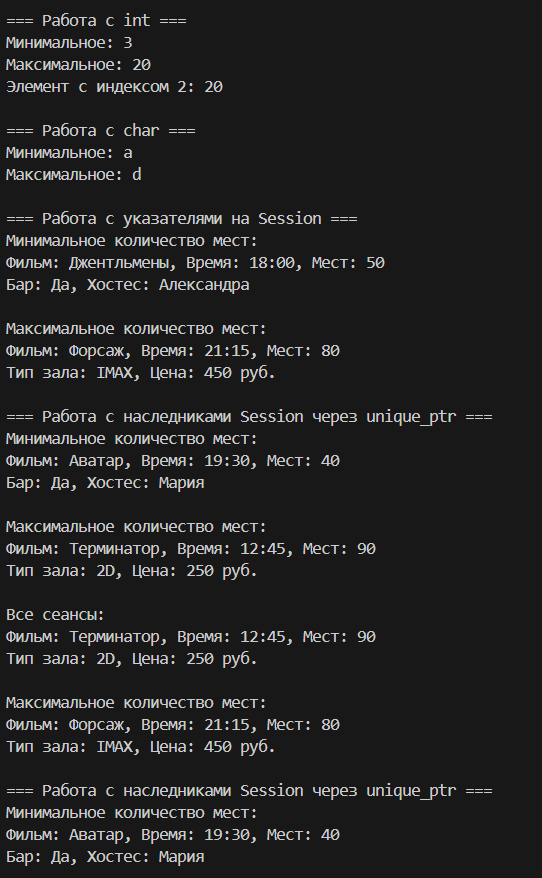
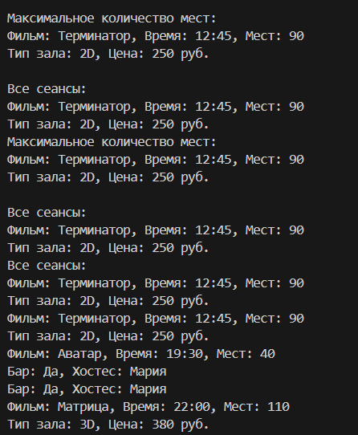

# Лабораторная работа №7
## Тема: "Шаблоны классов"
Выполнил: Торубаров М. Е.
Курс: 2
Группа: ПИЖ-б-0-23-2
## Задача:
1. Дополнить и при необходимости модифицировать приложение, разработанное согласно варианту лабораторной работы № 6.
2. Создать шаблон класса, в котором определить конструктор, в кото-ром реализовано создание массива на заданное количество элементов n (количество передается в параметре конструктору).
3. В шаблоне определить метод добавления элемента массива и ме-тод получения элемента массива по индексу.
4. В шаблоне определить функцию T min() и функцию T max(), ко-торые возвращают минимальное и максимальное значения из объектов мас-сива. Для работы этих функций потребуется перегрузка операторов сравнения в базовом классе. Сравнение объектов производить по любому из полей дан-ных базового класса.
5. В основном теле программы применить шаблон для разных ти-пов данных: int, char, указатель на базовый класс, каждый из классов-наследников.
## Листинг кода
```cpp
#include <iostream>
#include <string>
#include <vector>
#include <memory>
#include <algorithm>

using namespace std;

// Базовый класс Сеанс
class Session {
protected:
    string movieName;
    string sessionTime;
    int availableSeats;
    
public:
    Session() : movieName("Не указано"), sessionTime("12:00"), availableSeats(0) {}
    Session(string name, string time, int seats) : movieName(name), sessionTime(time), availableSeats(seats) {}
    
    virtual ~Session() = default;
    
    bool operator<(const Session& other) const {
        return availableSeats < other.availableSeats;
    }
    
    bool operator>(const Session& other) const {
        return availableSeats > other.availableSeats;
    }
    
    virtual void display() const {
        cout << "Фильм: " << movieName << ", Время: " << sessionTime 
             << ", Мест: " << availableSeats << endl;
    }
};

// Класс-наследник 1: Стандартный сеанс
class StandardSession : public Session {
private:
    string hallType;
    double ticketPrice;
    
public:
    StandardSession() : Session(), hallType("Обычный"), ticketPrice(0) {}
    StandardSession(string name, string time, int seats, string hall, double price) 
        : Session(name, time, seats), hallType(hall), ticketPrice(price) {}
    
    void display() const override {
        Session::display();
        cout << "Тип зала: " << hallType << ", Цена: " << ticketPrice << " руб." << endl;
    }
};

// Класс-наследник 2: VIP сеанс
class VipSession : public Session {
private:
    bool hasBarService;
    string personalHost;
    
public:
    VipSession() : Session(), hasBarService(false), personalHost("Не назначен") {}
    VipSession(string name, string time, int seats, bool bar, string host) 
        : Session(name, time, seats), hasBarService(bar), personalHost(host) {}
    
    void display() const override {
        Session::display();
        cout << "Бар: " << (hasBarService ? "Да" : "Нет") 
             << ", Хостес: " << personalHost << endl;
    }
};

// Шаблонный класс для управления массивом
template <typename T>
class ArrayManager {
private:
    vector<T> elements;
    
public:
    ArrayManager(size_t n) {
        elements.reserve(n);
    }
    
    // Для обычных типов
    void addElement(const T& element) {
        elements.push_back(element);
    }
    
    // Для unique_ptr
    void addElement(T&& element) {
        elements.push_back(std::move(element));
    }
    
    const T& getElement(size_t index) const {
        if (index >= elements.size()) {
            throw out_of_range("Индекс выходит за границы массива");
        }
        return elements[index];
    }
    
    // Для обычных типов и указателей
    const T& min() const {
        if (elements.empty()) {
            throw logic_error("Массив пуст");
        }
        return *min_element(elements.begin(), elements.end());
    }
    
    // Для unique_ptr
    template <typename U = T>
    typename enable_if<is_same<U, unique_ptr<Session>>::value, const U&>::type
    min() const {
        if (elements.empty()) {
            throw logic_error("Массив пуст");
        }
        return *min_element(elements.begin(), elements.end(),
            [](const unique_ptr<Session>& a, const unique_ptr<Session>& b) {
                return *a < *b;
            });
    }
    
    // Для обычных типов и указателей
    const T& max() const {
        if (elements.empty()) {
            throw logic_error("Массив пуст");
        }
        return *max_element(elements.begin(), elements.end());
    }
    
    // Для unique_ptr
    template <typename U = T>
    typename enable_if<is_same<U, unique_ptr<Session>>::value, const U&>::type
    max() const {
        if (elements.empty()) {
            throw logic_error("Массив пуст");
        }
        return *max_element(elements.begin(), elements.end(),
            [](const unique_ptr<Session>& a, const unique_ptr<Session>& b) {
                return *a < *b;
            });
    }
    
    void displayAll() const {
        for (const auto& elem : elements) {
            if constexpr (is_same_v<T, unique_ptr<Session>>) {
                elem->display();
            } else if constexpr (is_pointer_v<T>) {
                (*elem).display();
            } else {
                cout << elem << endl;
            }
        }
    }
};

// Перегрузка оператора << для Session
ostream& operator<<(ostream& os, const Session& session) {
    session.display();
    return os;
}

int main() {
    setlocale(LC_ALL, "Russian");
    
    // 1. Работа с int
    {
        cout << "=== Работа с int ===" << endl;
        ArrayManager<int> intManager(5);
        
        intManager.addElement(10);
        intManager.addElement(5);
        intManager.addElement(20);
        intManager.addElement(3);
        intManager.addElement(15);
        
        cout << "Минимальное: " << intManager.min() << endl;
        cout << "Максимальное: " << intManager.max() << endl;
        cout << "Элемент с индексом 2: " << intManager.getElement(2) << endl;
    }
    
    // 2. Работа с char
    {
        cout << "\n=== Работа с char ===" << endl;
        ArrayManager<char> charManager(4);
        
        charManager.addElement('d');
        charManager.addElement('a');
        charManager.addElement('c');
        charManager.addElement('b');
        
        cout << "Минимальное: " << charManager.min() << endl;
        cout << "Максимальное: " << charManager.max() << endl;
    }
    
    // 3. Работа с указателями на Session
    {
        cout << "\n=== Работа с указателями на Session ===" << endl;
        ArrayManager<Session*> sessionPtrManager(3);
        
        StandardSession s1("Интерстеллар", "15:30", 120, "3D", 350.0);
        VipSession v1("Джентльмены", "18:00", 50, true, "Александра");
        StandardSession s2("Форсаж", "21:15", 80, "IMAX", 450.0);
        
        sessionPtrManager.addElement(&s1);
        sessionPtrManager.addElement(&v1);
        sessionPtrManager.addElement(&s2);
        
        cout << "Минимальное количество мест:\n";
        sessionPtrManager.min()->display();
        
        cout << "\nМаксимальное количество мест:\n";
        sessionPtrManager.max()->display();
    }
    
    // 4. Работа с наследниками Session через unique_ptr
    {
        cout << "\n=== Работа с наследниками Session через unique_ptr ===" << endl;
        ArrayManager<unique_ptr<Session>> sessionManager(3);
        
        sessionManager.addElement(make_unique<StandardSession>("Терминатор", "12:45", 90, "2D", 250.0));
        sessionManager.addElement(make_unique<VipSession>("Аватар", "19:30", 40, true, "Мария"));
        sessionManager.addElement(make_unique<StandardSession>("Матрица", "22:00", 110, "3D", 380.0));
        
        cout << "Минимальное количество мест:\n";
        sessionManager.min()->display();
        
        cout << "\nМаксимальное количество мест:\n";
        sessionManager.max()->display();
        
        cout << "\nВсе сеансы:\n";
        sessionManager.displayAll();
    }
    
    return 0;
}
```
## Пример работы программы



## Описание алгоритма
В этом коде реализован алгоритм управления массивом с использованием шаблонного класса ArrayManager. Класс ArrayManager может работать с различными типами элементов, включая обычные типы, указатели и unique_ptr. В классе ArrayManager определены методы для добавления элементов, получения элемента по индексу, поиска минимального и максимального элемента, а также вывода всех элементов. Для работы с unique_ptr используются специальные методы и шаблонные функции. В функции main показаны примеры использования класса ArrayManager для работы с различными типами элементов.