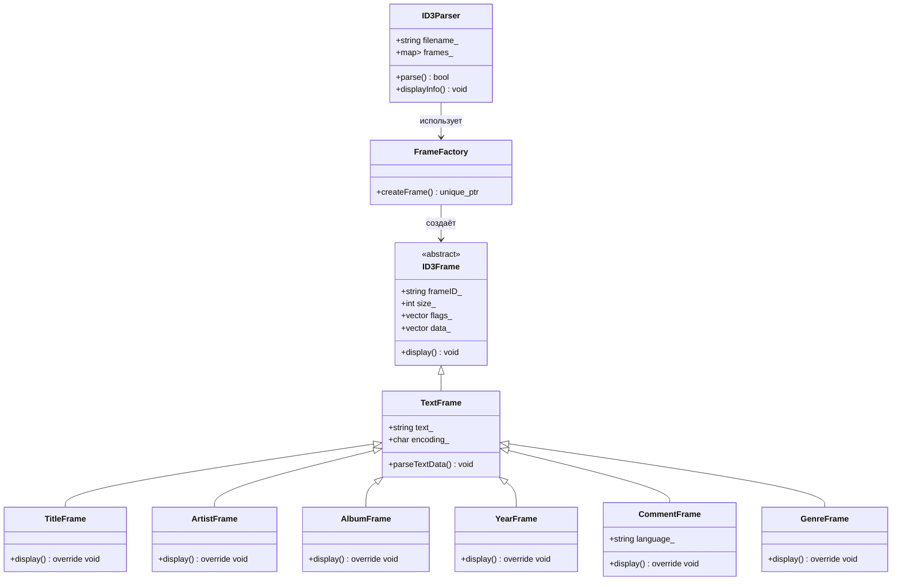

# Лабораторная работа №7
## Тема: "Парсер метаинформации в формате ID3v2.4 из mp3 - файлов."
Выполнил: Торубаров М. Е.
Курс: 2
Группа: ПИЖ-б-0-23-2
## Задача:
Реализовать консольное приложение для отображения метаинформации в формате ID3v2.4 из mp3-файлов.

Способ отображения - не специфицируется и остается на усмотрение автора.
Аргументы командной строки  - так же не специфицируются

## 1. Введение
Программа представляет собой консольное приложение для чтения и отображения метаданных из MP3-файлов в формате ID3v2.4. Реализована на C++ с использованием объектно-ориентированного подхода.

## 2. Структура классов

### 2.1 Иерархия классов фреймов

**Базовый класс**: `ID3Frame`

**Поля**:
| Поле | Тип | Описание |
|------|-----|----------|
| `frameID_` | `string` | Идентификатор фрейма (4 символа) |
| `size_` | `int` | Размер данных фрейма |
| `flags_` | `vector<char>` | Флаги фрейма |
| `data_` | `vector<char>` | Данные фрейма |

**Основные методы**:
```cpp
virtual void display() // Вывод информации о фрейме
```

**Классы-наследники**:

**TextFrame** - базовый класс для текстовых фреймов

**TitleFrame** - фрейм названия трека (TIT2)

**ArtistFrame** - фрейм исполнителя (TPE1)

**AlbumFrame** - фрейм альбома (TALB)

**YearFrame** - фрейм года (TYER)

**CommentFrame** - фрейм комментария (COMM)

**GenreFrame** - фрейм жанра (TCON)

## Класс FrameFactory

**Назначение**: Создание объектов фреймов по их идентификатору

**Методы**:

```cpp
static unique_ptr<ID3Frame> createFrame(...) // Фабричный метод
```

# Класс ID3Parser

**Назначение**: Чтение и обработка ID3 тегов из файла

**Поля:**

| Поле | Тип | Описание |
|------|-----|----------|
| filename_ | string | Имя файла |
| frames_ | map<string, unique_ptr<ID3Frame>> | Коллекция фреймов |

**Основные методы:**

```cpp
void skipUnsyncBytes(std::ifstream& file) // Пропуск unsync-байтов
int readSynchSafeInt(std::ifstream& file) // Чтение синхросейфного целого числа
std::string readFrameID(std::ifstream& file) // Чтение идентификатора фрейма
int readFrameSize(std::ifstream& file) // Чтение размера фрейма
std::vector<char> readFlags(std::ifstream& file) // Чтение флагов фрейма
std::vector<char> readFrameData(std::ifstream& file, int size) // Чтение данных фрейма
bool isID3v2Tag(std::ifstream& file) // Проверка наличия ID3v2 тега
bool parseFrame(std::ifstream& file) // Парсинг фрейма
bool parse() // Основной метод парсинга
void displayInfo() // Вывод информации
```

**Особенности реализации**

- Чтение тегов
 - Проверка заголовка: Поиск сигнатуры "ID3" в начале файла
 - Чтение размера тега: Синхросейф-формат (4 байта)
 - Обработка фреймов:
   - Чтение идентификатора (4 байта)
   - Чтение размера данных (4 байта)
   - Чтение флагов (2 байта)
   - Чтение данных фрейма
   - Обработка текстовых данных
     - Кодировка: Первый байт определяет кодировку текста
     - Очистка данных: Удаление нулевых символов
   - Специальная обработка для некоторых фреймов:
     - Комментарии содержат 3-байтовый код языка
     - Жанры могут храниться в числовом формате
 - Обработка ошибок
   - Проверка валидности идентификаторов фреймов
   - Проверка размера фреймов (максимум 10MB)
   - Контроль позиции чтения в файле

**Примеры использования**

# Базовое использование
id3_parser song.mp3

# Пример вывода:
```bash
=== MP3 Tag Information ===
Number of frames found: 2

Frame: TIT2 (TIT2)
=== Title ===
Frame ID: TIT2
Size: 111 bytes
Text:  ■Santana Medley (Evil WaysOye Como VaBlack Magic Woman)
Encoding: 1
-------------------------
Frame: TPE1 (TPE1)
=== Artist ===
Frame ID: TPE1
Size: 33 bytes
Text:  ■Type O Negative
Encoding: 1
```

**Ограничения**

- Поддерживаются только основные текстовые фреймы
- Максимальный размер фрейма - 10MB
- Не реализована полная поддержка:
 - Unsynchronisation
 - Сжатие данных
 - Шифрование
 - Ограниченная поддержка кодировок (только ISO-8859-1 и UTF-8)

**Диаграмма классов**
