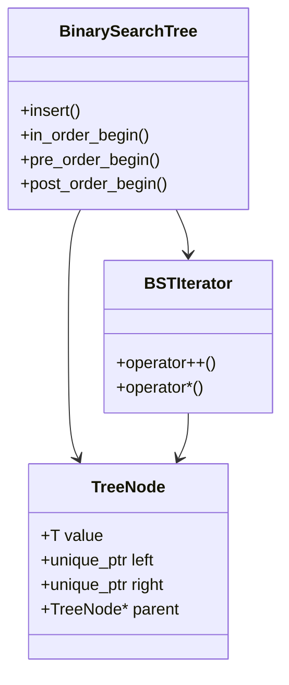

# Лабораторная работа №8
## Тема: "Бинарное дерево поиска. Шаблоны. STL."
**Выполнил:** Торубаров М. Е.  
**Курс:** 2  
**Группа:** ПИЖ-б-0-23-2  

## Задача:
Реализовать три STL-совместимых контейнера для [BinarySearchTree](https://en.wikipedia.org/wiki/Binary_search_tree), реализующие различные [способы обхода дерева (in-, pre-, post-order)](https://en.wikipedia.org/wiki/Tree_traversal) через итератор.

## 1. Введение
Программа представляет собой шаблонную реализацию бинарного дерева поиска (BST) с поддержкой STL-совместимых итераторов для различных видов обхода. Реализована на C++ с использованием:
- Шаблонов
- Умных указателей (unique_ptr)
- STL-аллокаторов
- Диспетчеризации тегов

## 2. Структура классов

### 2.1 Основные компоненты

**Класс TreeNode**:
```cpp
template <typename T>
struct TreeNode {
    T value;
    std::unique_ptr<TreeNode<T>> left;
    std::unique_ptr<TreeNode<T>> right;
    TreeNode<T>* parent;
};
```
**Шаблонный класс BSTIterator:**

```cpp
template <typename T, typename OrderTag>
class BSTIterator {
    // Итератор с поддержкой:
    // - std::bidirectional_iterator_tag
    // - Диспетчеризация через OrderTag
    // - Методы advance для разных видов обхода
};
```
**Класс BinarySearchTree:**

```cpp
template <typename T, typename Compare, typename Allocator>
class BinarySearchTree {
    // Поддерживает:
    // - Вставку элементов
    // - Три типа итераторов
    // - Кастомные компаратор и аллокатор
};
```
## 3. Реализация итераторов
### 3.1 Теги для диспетчеризации
```cpp
struct InOrderTag {};
struct PreOrderTag {};
struct PostOrderTag {};
```
### 3.2 Логика обхода
| Тип обхода  | Порядок | Метод `advance`                              |
|-------------|---------|---------------------------------------------|
| **In-order**  | LNR     | Поиск следующего узла в симметричном порядке: <br>1. Если есть правое поддерево - идём в его крайний левый узел<br>2. Иначе поднимаемся до первого правого родителя |
| **Pre-order** | NLR     | Обход в глубину с приоритетом корня: <br>1. Сначала посещаем текущий узел<br>2. Затем рекурсивно левое поддерево<br>3. Затем рекурсивно правое поддерево |
| **Post-order**| LRN     | Обход в глубину с приоритетом листьев: <br>1. Сначала рекурсивно левое поддерево<br>2. Затем правое поддерево<br>3. В последнюю очередь корень |
## 4. Примеры использования
**Базовое создание дерева**
```cpp
BinarySearchTree<int> tree;
tree.insert(5);
tree.insert(3);
tree.insert(7);
```
**Обход in-order**
```cpp
for (auto it = tree.in_order_begin(); it != tree.in_order_end(); ++it) {
    cout << *it << " ";  // Вывод: 2 3 4 5 6 7 8
}
```
**Обход pre-order**
```cpp
for (auto it = tree.pre_order_begin(); it != tree.pre_order_end(); ++it) {
    cout << *it << " ";  // Вывод: 5 3 2 4 7 6 8
}
```
## 5. Тестирование
**Реализованы тесты с использованием Google Test:**

* Проверка корректности вставки элементов

* Валидация всех видов обхода

* Проверка работы итераторов

**Код тестов:**
```cpp
#include <gtest/gtest.h>
#include "../include/bst.hpp"

class BSTTest : public ::testing::Test {
protected:
    void SetUp() override {
        tree.insert(5);
        tree.insert(3);
        tree.insert(7);
        tree.insert(2);
        tree.insert(4);
        tree.insert(6);
        tree.insert(8);
    }
    
    BinarySearchTree<int> tree;
};

// Тест in-order обхода
TEST_F(BSTTest, InOrderTraversal) {
    std::vector<int> expected = {2, 3, 4, 5, 6, 7, 8};
    std::vector<int> actual;
    
    for (auto it = tree.in_order_begin(); it != tree.in_order_end(); ++it) {
        actual.push_back(*it);
    }
    
    ASSERT_EQ(expected, actual);
}

// Тест pre-order обхода
TEST_F(BSTTest, PreOrderTraversal) {
    std::vector<int> expected = {5, 3, 2, 4, 7, 6, 8};
    std::vector<int> actual;
    
    for (auto it = tree.pre_order_begin(); it != tree.pre_order_end(); ++it) {
        actual.push_back(*it);
    }
    
    ASSERT_EQ(expected, actual);
}

// Тест post-order обхода 
TEST_F(BSTTest, PostOrderTraversal) {
    std::vector<int> expected = {2, 4, 3, 6, 8, 7, 5};
    std::vector<int> actual;
    
    for (auto it = tree.post_order_begin(); it != tree.post_order_end(); ++it) {
        actual.push_back(*it);
    }
    
    ASSERT_EQ(expected, actual);
}

// Тест вставки и поиска
TEST_F(BSTTest, InsertAndFind) {
    auto it = tree.in_order_begin();
    ASSERT_EQ(2, *it);
    ++++it; 
    ASSERT_EQ(4, *it);
}

int main(int argc, char **argv) {
    ::testing::InitGoogleTest(&argc, argv);
    return RUN_ALL_TESTS();
}
```

**Результаты тестирования:**

```bash
Test project D:/University/Dev/C++/labwork8/build
    Start 1: bst_test
    Start 1: bst_test
1/1 Test #1: bst_test .........................   Passed    0.06 sec

100% tests passed, 0 tests failed out of 1

Total Test time (real) =   0.07 sec
```
## 6. Диаграмма классов


## 7. Ограничения
* Нет реализации удаления элементов

* Нет поддержки константных итераторов

* Нет обработки дубликатов (зависит от компаратора)

## 8. Вывод
Реализовано STL-совместимое бинарное дерево поиска с тремя типами итераторов. Подтверждена корректность работы через unit-тесты. Основные алгоритмы обхода работают за O(h), где h - высота дерева.