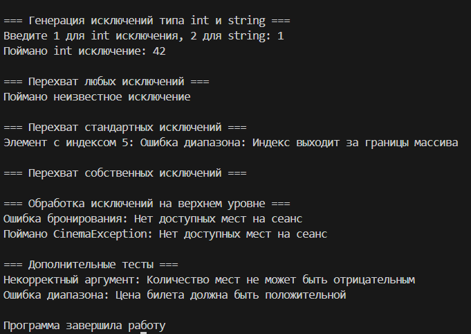

# Лабораторная работа №8
## Тема: "Обработка исключений"
Выполнил: Торубаров М. Е.
Курс: 2
Группа: ПИЖ-б-0-23-2
## Задача:
1. Дополнить и при необходимости модифицировать приложение, разработанное согласно варианту лабораторной работы № 7.
65
2. Написать программу, в которой перехватываются исключения типа int, string. Сгенерировать исключительные ситуации.
3. Добавить к программе перехват любой исключительной ситуации catch(…).
4. Добавить к программе перехват 2-3 исключительных ситуаций стандартных типов (std::invalid_argument, std::length_error, std::out_of_range или др.).
5. Создайть два собственных класса ошибки, наследуемых от стан-дартного. Добавить к программе перехват исключительных ситуаций создан-ных типов.
6. Программа должна демонстрировать обработку исключительных ситуаций на верхнем уровне (функция main), возникающих при вложенных вызовах методов объектов.
7. Программа должна демонстрировать локальную обработку исклю-чительных ситуаций без передачи ее обработчику более высокого уровня.
## Листинг кода
```cpp
#include <iostream>
#include <string>
#include <vector>
#include <memory>
#include <algorithm>
#include <stdexcept>

using namespace std;

// Собственные классы исключений 
class CinemaException : public std::runtime_error {
public:
    CinemaException(const string& msg) : runtime_error(msg) {}
};

class NoSeatsException : public CinemaException {
public:
    NoSeatsException() : CinemaException("Нет доступных мест на сеанс") {}
};

class InvalidTimeException : public CinemaException {
public:
    InvalidTimeException() : CinemaException("Некорректное время сеанса") {}
};

// Базовый класс Сеанс
class Session {
protected:
    string movieName;
    string sessionTime;
    int availableSeats;
    
public:
    Session() : movieName("Не указано"), sessionTime("12:00"), availableSeats(0) {}
    Session(string name, string time, int seats) : movieName(name), sessionTime(time), availableSeats(seats) {
        // Генерация исключения 
        if (seats < 0) {
            throw invalid_argument("Количество мест не может быть отрицательным");
        }
        
        // Проверка времени (может генерировать наше собственное исключение)
        if (time.length() != 5 || time[2] != ':') {
            throw InvalidTimeException();
        }
    }
    
    virtual ~Session() = default;
    
    bool operator<(const Session& other) const {
        return availableSeats < other.availableSeats;
    }
    
    bool operator>(const Session& other) const {
        return availableSeats > other.availableSeats;
    }
    
    virtual void display() const {
        cout << "Фильм: " << movieName << ", Время: " << sessionTime 
             << ", Мест: " << availableSeats << endl;
    }
    
    // Метод, который может генерировать исключение 
    void bookSeats(int num) {
        if (num <= 0) {
            throw invalid_argument("Количество мест должно быть положительным");
        }
        if (availableSeats < num) {
            throw NoSeatsException();
        }
        availableSeats -= num;
        cout << "Забронировано " << num << " мест на фильм " << movieName << endl;
    }
};

// Класс-наследник 1: Стандартный сеанс
class StandardSession : public Session {
private:
    string hallType;
    double ticketPrice;
    
public:
    StandardSession() : Session(), hallType("Обычный"), ticketPrice(0) {}
    StandardSession(string name, string time, int seats, string hall, double price) 
        : Session(name, time, seats), hallType(hall), ticketPrice(price) {
        if (price <= 0) {
            throw out_of_range("Цена билета должна быть положительной");
        }
    }
    
    void display() const override {
        Session::display();
        cout << "Тип зала: " << hallType << ", Цена: " << ticketPrice << " руб." << endl;
    }
};

// Класс-наследник 2: VIP сеанс
class VipSession : public Session {
private:
    bool hasBarService;
    string personalHost;
    
public:
    VipSession() : Session(), hasBarService(false), personalHost("Не назначен") {}
    VipSession(string name, string time, int seats, bool bar, string host) 
        : Session(name, time, seats), hasBarService(bar), personalHost(host) {
        if (host.empty()) {
            throw length_error("Имя хостес не может быть пустым");
        }
    }
    
    void display() const override {
        Session::display();
        cout << "Бар: " << (hasBarService ? "Да" : "Нет") 
             << ", Хостес: " << personalHost << endl;
    }
};

// Шаблонный класс для управления массивом
template <typename T>
class ArrayManager {
private:
    vector<T> elements;
    
public:
    ArrayManager(size_t n) {
        elements.reserve(n);
    }
    
    // Для обычных типов
    void addElement(const T& element) {
        elements.push_back(element);
    }
    
    // Для unique_ptr
    void addElement(T&& element) {
        elements.push_back(std::move(element));
    }
    
    const T& getElement(size_t index) const {
        if (index >= elements.size()) {
            throw out_of_range("Индекс выходит за границы массива");
        }
        return elements[index];
    }
    
    // Для обычных типов и указателей
    const T& min() const {
        if (elements.empty()) {
            throw logic_error("Массив пуст");
        }
        return *min_element(elements.begin(), elements.end());
    }
    
    // Для unique_ptr
    template <typename U = T>
    typename enable_if<is_same<U, unique_ptr<Session>>::value, const U&>::type
    min() const {
        if (elements.empty()) {
            throw logic_error("Массив пуст");
        }
        return *min_element(elements.begin(), elements.end(),
            [](const unique_ptr<Session>& a, const unique_ptr<Session>& b) {
                return *a < *b;
            });
    }
    
    // Для обычных типов и указателей
    const T& max() const {
        if (elements.empty()) {
            throw logic_error("Массив пуст");
        }
        return *max_element(elements.begin(), elements.end());
    }
    
    // Для unique_ptr
    template <typename U = T>
    typename enable_if<is_same<U, unique_ptr<Session>>::value, const U&>::type
    max() const {
        if (elements.empty()) {
            throw logic_error("Массив пуст");
        }
        return *max_element(elements.begin(), elements.end(),
            [](const unique_ptr<Session>& a, const unique_ptr<Session>& b) {
                return *a < *b;
            });
    }
    
    void displayAll() const {
        for (const auto& elem : elements) {
            if constexpr (is_same_v<T, unique_ptr<Session>>) {
                elem->display();
            } else if constexpr (is_pointer_v<T>) {
                (*elem).display();
            } else {
                cout << elem << endl;
            }
        }
    }
};

// Перегрузка оператора << для Session
ostream& operator<<(ostream& os, const Session& session) {
    session.display();
    return os;
}

// Функция для демонстрации локальной обработки исключений
void demoLocalExceptionHandling() {
    try {
        VipSession vip("Мстители", "20:00", 30, true, "");
        cout << "Это сообщение не будет выведено" << endl;
    } 
    catch (const length_error& e) {
        cout << "[Локальная обработка] Ошибка длины: " << e.what() << endl;
    }
    cout << "Локальная обработка завершена, программа продолжает работу\n";
}

// Функция, которая может генерировать разные исключения 
void processSession(Session& session) {
    try {
        // Попробуем забронировать места
        session.bookSeats(100);
    }
    catch (const NoSeatsException& e) {
        cout << "Ошибка бронирования: " << e.what() << endl;
        throw; // Передаем исключение выше
    }
}

int main() {
    setlocale(LC_ALL, "Russian");
    
    // Демонстрация локальной обработки исключений 
    demoLocalExceptionHandling();
    
    try {
        // 1. Генерация и перехват исключений типа int и string 
        cout << "\n=== Генерация исключений типа int и string ===" << endl;
        try {
            int choice;
            cout << "Введите 1 для int исключения, 2 для string: ";
            cin >> choice;
            
            if (choice == 1) {
                throw 42;
            } else if (choice == 2) {
                throw string("Строковая ошибка");
            }
        }
        catch (int e) {
            cout << "Поймано int исключение: " << e << endl;
        }
        catch (const string& e) {
            cout << "Поймано string исключение: " << e << endl;
        }
        
        // 2. Перехват любых исключений 
        cout << "\n=== Перехват любых исключений ===" << endl;
        try {
            throw 3.14; // double исключение
        }
        catch (...) {
            cout << "Поймано неизвестное исключение" << endl;
        }
        
        // 3. Перехват стандартных исключений 
        cout << "\n=== Перехват стандартных исключений ===" << endl;
        try {
            ArrayManager<int> manager(3);
            manager.addElement(1);
            manager.addElement(2);
            cout << "Элемент с индексом 5: " << manager.getElement(5) << endl;
        }
        catch (const out_of_range& e) {
            cout << "Ошибка диапазона: " << e.what() << endl;
        }
        catch (const logic_error& e) {
            cout << "Логическая ошибка: " << e.what() << endl;
        }
        
        // 4. Перехват собственных исключений 
        cout << "\n=== Перехват собственных исключений ===" << endl;
        try {
            Session s("Дюна", "25:00", 100); // Некорректное время
        }
        catch (const InvalidTimeException& e) {
            cout << "Ошибка времени сеанса: " << e.what() << endl;
        }
        
        // 5. Обработка исключений на верхнем уровне 
        cout << "\n=== Обработка исключений на верхнем уровне ===" << endl;
        try {
            StandardSession movie("Титаник", "18:30", 50, "3D", 400.0);
            processSession(movie); // Попытка забронировать слишком много мест
            
            // Это не будет выполнено из-за исключения
            cout << "Это сообщение не будет выведено" << endl;
        }
        catch (const CinemaException& e) {
            cout << "Поймано CinemaException: " << e.what() << endl;
        }
        catch (const exception& e) {
            cout << "Стандартное исключение: " << e.what() << endl;
        }
        
        // 6. Дополнительные тесты
        cout << "\n=== Дополнительные тесты ===" << endl;
        try {
            VipSession vip("Джокер", "19:45", -10, true, "Анна"); // Отрицательное количество мест
        }
        catch (const invalid_argument& e) {
            cout << "Некорректный аргумент: " << e.what() << endl;
        }
        
        try {
            StandardSession cheap("Чебурашка", "10:00", 100, "2D", -100.0); // Отрицательная цена
        }
        catch (const out_of_range& e) {
            cout << "Ошибка диапазона: " << e.what() << endl;
        }
        
    }
    catch (...) {
        cout << "Перехвачено неизвестное исключение в самом внешнем блоке" << endl;
    }
    
    cout << "\nПрограмма завершила работу" << endl;
    return 0;
}
```
## Пример работы программы


## Описание алгоритма
В этом коде реализован алгоритм управления массивом с использованием шаблонного класса ArrayManager. Класс ArrayManager может работать с различными типами элементов, включая обычные типы, указатели и unique_ptr. В классе ArrayManager определены методы для добавления элементов, получения элемента по индексу, поиска минимального и максимального элемента, а также вывода всех элементов. Для работы с unique_ptr используются специальные методы и шаблонные функции. В функции main показаны примеры использования класса ArrayManager для работы с различными типами элементов.