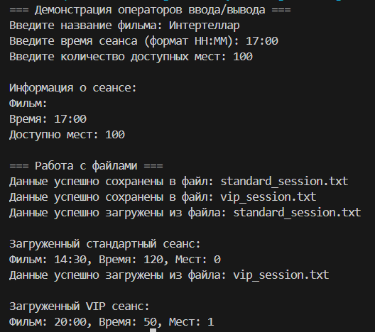

# Лабораторная работа №9
## Тема: "Обработка исключений"
Выполнил: Торубаров М. Е.
Курс: 2
Группа: ПИЖ-б-0-23-2
## Задача:
1. Дополнить и при необходимости модифицировать приложение, разработанное согласно варианту лабораторной работы № 8.
2. Определить глобальный оператор << для вывода данных базового класса на экран.
3. Определить глобальный оператор >> для вывода данных в объект базового класса на экран.
4. Организовать сохранение данных объекта основного класса в файл.
5. Организовать чтение данных из файла и занесение их в объект ос-новного класса.
## Листинг кода
```cpp
#include <iostream>
#include <string>
#include <vector>
#include <memory>
#include <algorithm>
#include <stdexcept>
#include <fstream>

using namespace std;

// Собственные классы исключений
class CinemaException : public std::runtime_error {
public:
    CinemaException(const string& msg) : runtime_error(msg) {}
};

class NoSeatsException : public CinemaException {
public:
    NoSeatsException() : CinemaException("Нет доступных мест на сеанс") {}
};

class InvalidTimeException : public CinemaException {
public:
    InvalidTimeException() : CinemaException("Некорректное время сеанса") {}
};

// Базовый класс Сеанс
class Session {
protected:
    string movieName;
    string sessionTime;
    int availableSeats;
    
public:
    Session() : movieName("Не указано"), sessionTime("12:00"), availableSeats(0) {}
    Session(string name, string time, int seats) : movieName(name), sessionTime(time), availableSeats(seats) {
        if (seats < 0) {
            throw invalid_argument("Количество мест не может быть отрицательным");
        }
        
        if (time.length() != 5 || time[2] != ':') {
            throw InvalidTimeException();
        }
    }
    
    virtual ~Session() = default;
    
    bool operator<(const Session& other) const {
        return availableSeats < other.availableSeats;
    }
    
    bool operator>(const Session& other) const {
        return availableSeats > other.availableSeats;
    }
    
    virtual void display() const {
        cout << "Фильм: " << movieName << ", Время: " << sessionTime 
             << ", Мест: " << availableSeats << endl;
    }
    
    // Методы для работы с файлами
    virtual void saveToFile(ofstream& out) const {
        out << movieName << endl;
        out << sessionTime << endl;
        out << availableSeats << endl;
    }
    
    virtual void loadFromFile(ifstream& in) {
        getline(in, movieName);
        getline(in, sessionTime);
        in >> availableSeats;
        in.ignore(); // Пропустить символ новой строки
    }
    
    void bookSeats(int num) {
        if (num <= 0) {
            throw invalid_argument("Количество мест должно быть положительным");
        }
        if (availableSeats < num) {
            throw NoSeatsException();
        }
        availableSeats -= num;
        cout << "Забронировано " << num << " мест на фильм " << movieName << endl;
    }
    
    // Дружественные операторы для ввода/вывода
    friend ostream& operator<<(ostream& os, const Session& session);
    friend istream& operator>>(istream& is, Session& session);
};

// Глобальный оператор << для вывода (пункт 2)
ostream& operator<<(ostream& os, const Session& session) {
    os << "Фильм: " << session.movieName << "\nВремя: " << session.sessionTime 
       << "\nДоступно мест: " << session.availableSeats;
    return os;
}

// Глобальный оператор >> для ввода (пункт 3)
istream& operator>>(istream& is, Session& session) {
    cout << "Введите название фильма: ";
    getline(is, session.movieName);
    
    cout << "Введите время сеанса (формат HH:MM): ";
    getline(is, session.sessionTime);
    
    cout << "Введите количество доступных мест: ";
    is >> session.availableSeats;
    is.ignore(); // Пропустить символ новой строки
    
    return is;
}

// Класс-наследник 1: Стандартный сеанс
class StandardSession : public Session {
private:
    string hallType;
    double ticketPrice;
    
public:
    StandardSession() : Session(), hallType("Обычный"), ticketPrice(0) {}
    StandardSession(string name, string time, int seats, string hall, double price) 
        : Session(name, time, seats), hallType(hall), ticketPrice(price) {
        if (price <= 0) {
            throw out_of_range("Цена билета должна быть положительной");
        }
    }
    
    void display() const override {
        Session::display();
        cout << "Тип зала: " << hallType << ", Цена: " << ticketPrice << " руб." << endl;
    }
    
    void saveToFile(ofstream& out) const override {
        Session::saveToFile(out);
        out << hallType << endl;
        out << ticketPrice << endl;
    }
    
    void loadFromFile(ifstream& in) override {
        Session::loadFromFile(in);
        getline(in, hallType);
        in >> ticketPrice;
        in.ignore();
    }
};

// Класс-наследник 2: VIP сеанс
class VipSession : public Session {
private:
    bool hasBarService;
    string personalHost;
    
public:
    VipSession() : Session(), hasBarService(false), personalHost("Не назначен") {}
    VipSession(string name, string time, int seats, bool bar, string host) 
        : Session(name, time, seats), hasBarService(bar), personalHost(host) {
        if (host.empty()) {
            throw length_error("Имя хостес не может быть пустым");
        }
    }
    
    void display() const override {
        Session::display();
        cout << "Бар: " << (hasBarService ? "Да" : "Нет") 
             << ", Хостес: " << personalHost << endl;
    }
    
    void saveToFile(ofstream& out) const override {
        Session::saveToFile(out);
        out << hasBarService << endl;
        out << personalHost << endl;
    }
    
    void loadFromFile(ifstream& in) override {
        Session::loadFromFile(in);
        in >> hasBarService;
        in.ignore();
        getline(in, personalHost);
    }
};

// Функция для сохранения объекта в файл (пункт 4)
void saveSessionToFile(const Session& session, const string& filename) {
    ofstream outFile(filename);
    if (!outFile) {
        throw runtime_error("Не удалось открыть файл для записи");
    }
    session.saveToFile(outFile);
    cout << "Данные успешно сохранены в файл: " << filename << endl;
}

// Функция для загрузки объекта из файла (пункт 5)
unique_ptr<Session> loadSessionFromFile(const string& filename) {
    ifstream inFile(filename);
    if (!inFile) {
        throw runtime_error("Не удалось открыть файл для чтения");
    }
    
    string type;
    getline(inFile, type); // Первая строка - тип сеанса
    
    unique_ptr<Session> session;
    if (type == "Standard") {
        session = make_unique<StandardSession>();
    } else if (type == "VIP") {
        session = make_unique<VipSession>();
    } else {
        session = make_unique<Session>();
    }
    
    session->loadFromFile(inFile);
    cout << "Данные успешно загружены из файла: " << filename << endl;
    return session;
}

int main() {
    setlocale(LC_ALL, "Russian");
    
    try {
        // Демонстрация операторов ввода/вывода
        cout << "=== Демонстрация операторов ввода/вывода ===" << endl;
        Session session1;
        cin >> session1;
        cout << "\nИнформация о сеансе:\n" << session1 << endl;
        
        // Демонстрация сохранения в файл и загрузки
        cout << "\n=== Работа с файлами ===" << endl;
        StandardSession stdSession("Аватар", "14:30", 120, "IMAX", 500.0);
        saveSessionToFile(stdSession, "standard_session.txt");
        
        VipSession vipSession("Джокер", "20:00", 50, true, "Анна");
        saveSessionToFile(vipSession, "vip_session.txt");
        
        auto loadedStd = loadSessionFromFile("standard_session.txt");
        cout << "\nЗагруженный стандартный сеанс:\n";
        loadedStd->display();
        
        auto loadedVip = loadSessionFromFile("vip_session.txt");
        cout << "\nЗагруженный VIP сеанс:\n";
        loadedVip->display();
        
    } catch (const exception& e) {
        cerr << "Ошибка: " << e.what() << endl;
        return 1;
    }
    
    return 0;
}
```
## Пример работы программы


## Описание алгоритма
В этом коде реализован алгоритм работы с сеансами кинотеатра. Класс Session является базовым классом для всех сеансов, а классы StandardSession и VipSession являются его наследниками. Класс Session содержит информацию о фильме, времени сеанса и количестве доступных мест. Классы StandardSession и VipSession добавляют дополнительную информацию о типе зала и цене билета для стандартного сеанса, а также о наличии бара и имени хостес для VIP сеанса. В классе Session также реализованы методы для работы с файлами, а именно сохранения и загрузки данных о сеансе. В функции main демонстрируется работа операторов ввода/вывода и сохранения/загрузки данных о сеансах.