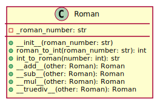

# Римское число
Создайте класс Roman (Римское Число), представляющий римское число и поддерживающий операции +, -, *, /.
```PYTHON
#main.py
class Roman:
    """
    Класс для работы с римскими числами.
    """

    def __init__(self, roman_number: str):
        """
        Инициализация объекта класса Roman.

        :param roman_number: римское число в виде строки
        """
        self._roman_number: str = roman_number

    @staticmethod
    def roman_to_int(roman_number) -> int:
        """
        Преобразование римского числа в целое число.

        :param roman_number: римское число в виде строки
        :return: целое число
        """
        for i in roman_number:
            if i not in "IVXLCDM":
                raise ValueError("Invalid roman number")
        roman_dict = {
            "I": 1, "V": 5, "X": 10, "L": 50, "C": 100, "D": 500, "M": 1000
            }
        result = 0
        for i in range(len(roman_number)):
            if (
                i < len(roman_number) - 1
                and roman_dict[roman_number[i]] < roman_dict[roman_number[
                    i + 1]]
            ):
                result -= roman_dict[roman_number[i]]
            else:
                result += roman_dict[roman_number[i]]
        return result

    @staticmethod
    def int_to_roman(number: int) -> str:
        """
        Преобразование целого числа в римское число.

        :param number: целое число
        :return: римское число в виде строки
        """
        val = [1000, 900, 500, 400, 100, 90, 50, 40, 10, 9, 5, 4, 1]
        syb = ["M", "CM", "D", "CD", "C", "XC", "L",
               "XL", "X", "IX", "V", "IV", "I"]
        roman_num = ""
        i = 0
        while number > 0:
            for el in range(int(number // val[i])):
                roman_num += syb[i]
                number -= val[i]
            i += 1
        return roman_num

    def __add__(self, other):
        """
        Сложение двух римских чисел.

        :param other: объект класса Roman
        :return: результат сложения в виде римского числа
        """
        return Roman.int_to_roman(
            self.roman_to_int(self._roman_number)
            + self.roman_to_int(other._roman_number)
        )

    def __sub__(self, other):
        """
        Вычитание двух римских чисел.

        :param other: объект класса Roman
        :return: результат вычитания в виде римского числа
        """
        return Roman.int_to_roman(
            self.roman_to_int(self._roman_number)
            - self.roman_to_int(other._roman_number)
        )

    def __mul__(self, other):
        """
        Умножение двух римских чисел.

        :param other: объект класса Roman
        :return: результат умножения в виде римского числа
        """
        return Roman.int_to_roman(
            self.roman_to_int(self._roman_number)
            * self.roman_to_int(other._roman_number)
        )

    def __truediv__(self, other):
        """
        Деление двух римских чисел.

        :param other: объект класса Roman
        :return: результат деления в виде римского числа
        """
        return Roman.int_to_roman(
            self.roman_to_int(self._roman_number)
            / self.roman_to_int(other._roman_number)
        )
```
```PYTHON
#main_test.py
from main import Roman


def test_roman_to_int():
    assert Roman.roman_to_int("I") == 1
    assert Roman.roman_to_int("IV") == 4
    assert Roman.roman_to_int("V") == 5
    assert Roman.roman_to_int("IX") == 9
    assert Roman.roman_to_int("X") == 10
    assert Roman.roman_to_int("XL") == 40
    assert Roman.roman_to_int("L") == 50
    assert Roman.roman_to_int("XC") == 90
    assert Roman.roman_to_int("C") == 100
    assert Roman.roman_to_int("CD") == 400
    assert Roman.roman_to_int("D") == 500
    assert Roman.roman_to_int("CM") == 900
    assert Roman.roman_to_int("M") == 1000
    assert Roman.roman_to_int("MM") == 2000
    assert Roman.roman_to_int("MMM") == 3000
    assert Roman.roman_to_int("MMMM") == 4000
    assert Roman.roman_to_int("MMMMM") == 5000
    assert Roman.roman_to_int("MMMMMM") == 6000
    assert Roman.roman_to_int("MMMMMMM") == 7000
    assert Roman.roman_to_int("MMMMMMMM") == 8000
    assert Roman.roman_to_int("MMMMMMMMM") == 9000
    assert Roman.roman_to_int("MMMMMMMMMM") == 10000


def test_int_to_roman():
    assert Roman.int_to_roman(1) == "I"
    assert Roman.int_to_roman(4) == "IV"
    assert Roman.int_to_roman(5) == "V"
    assert Roman.int_to_roman(9) == "IX"
    assert Roman.int_to_roman(10) == "X"
    assert Roman.int_to_roman(40) == "XL"
    assert Roman.int_to_roman(50) == "L"
    assert Roman.int_to_roman(90) == "XC"
    assert Roman.int_to_roman(100) == "C"
    assert Roman.int_to_roman(400) == "CD"
    assert Roman.int_to_roman(500) == "D"
    assert Roman.int_to_roman(900) == "CM"
    assert Roman.int_to_roman(1000) == "M"
    assert Roman.int_to_roman(2000) == "MM"
    assert Roman.int_to_roman(3000) == "MMM"
    assert Roman.int_to_roman(4000) == "MMMM"
    assert Roman.int_to_roman(5000) == "MMMMM"
    assert Roman.int_to_roman(6000) == "MMMMMM"
    assert Roman.int_to_roman(7000) == "MMMMMMM"
    assert Roman.int_to_roman(8000) == "MMMMMMMM"
    assert Roman.int_to_roman(9000) == "MMMMMMMMM"
    assert Roman.int_to_roman(10000) == "MMMMMMMMMM"


def test_add():
    roman1 = Roman("I")
    roman2 = Roman("V")
    assert roman1 + roman2 == "VI"


def test_sub():
    roman1 = Roman("V")
    roman2 = Roman("I")
    assert roman1 - roman2 == "IV"


def test_mul():
    roman1 = Roman("V")
    roman2 = Roman("I")
    assert roman1 * roman2 == "V"


def test_truediv():
    roman1 = Roman("V")
    roman2 = Roman("I")
    assert roman1 / roman2 == "V"
```

## UML диаграмма класса Roman:
