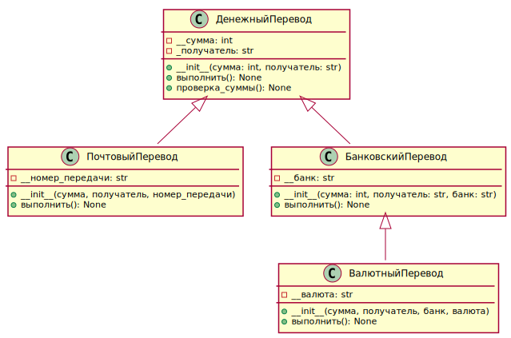

# Иерархия классов
## Вариант 4
### Классы: 
* Денежный перевод
* Почтовый перевод
* Банковский перевод
* Валютный перевод
### Задача:
* выстройте классы в иерархию, продумайте их общие и отличительные характеристики и действия
* добавьте собственную реализацию методов базового класса в каждый из классов

```PYTHON
#Перевод.py
class ДенежныйПеревод:
    """
    Класс для выполнения денежного перевода.

    Атрибуты:
        __сумма (float): Сумма перевода.
        _получатель (str): Получатель перевода.
    """

    def __init__(self, сумма: int, получатель: str) -> None:
        self.__сумма: int = сумма  # Закрытое поле
        self._получатель: str = получатель  # Защищенное поле

    def выполнить(self) -> None:
        """
        Выполняет денежный перевод.
        """
        print(
            f"Выполняется денежный перевод на сумму {
                self.__сумма} к получателю {self._получатель}."
        )

    def проверка_суммы(self) -> None:  # общедоступный метод
        """
        Проверяет, что сумма перевода положительна.
        """
        if self.__сумма <= 0:
            raise ValueError("Сумма перевода должна быть положительной.")


class ПочтовыйПеревод(ДенежныйПеревод):
    """
    Класс для выполнения почтового перевода.

    Атрибуты:
        __номер_передачи (str): Номер передачи.
    """

    def __init__(self, сумма, получатель, номер_передачи) -> None:
        super().__init__(сумма, получатель)
        self.__номер_передачи: str = номер_передачи  # Закрытое поле

    def выполнить(self):
        """
        Выполняет почтовый перевод.
        """
        self.проверка_суммы()
        print(
            f"Выполняется почтовый перевод на сумму {
                self._ДенежныйПеревод__сумма} к получателю {
                    self._получатель}. Номер передачи: {
                        self.__номер_передачи}."
        )


class БанковскийПеревод(ДенежныйПеревод):
    """
    Класс для выполнения банковского перевода.

    Атрибуты:
        __банк (str): Банк, через который осуществляется перевод.
    """

    def __init__(self, сумма: int, получатель: str, банк: str) -> None:
        super().__init__(сумма, получатель)
        self.__банк: str = банк  # Закрытое поле

    def выполнить(self):
        """
        Выполняет банковский перевод.
        """
        self.проверка_суммы()
        print(
            f"Выполняется банковский перевод на сумму {
                self._ДенежныйПеревод__сумма} к получателю {
                    self._получатель}. Банк: {self.__банк}."
        )


class ВалютныйПеревод(БанковскийПеревод):
    """
    Класс для выполнения валютного перевода.

    Атрибуты:
        __валюта (str): Валюта перевода.
    """

    def __init__(self, сумма, получатель, банк, валюта):
        super().__init__(сумма, получатель, банк)
        self.__валюта = валюта  # Закрытое поле

    def выполнить(self):
        """
        Выполняет валютный перевод.
        """
        self.проверка_суммы()
        print(
            f"Выполняется валютный перевод на сумму {
                self._ДенежныйПеревод__сумма} {
                    self.__валюта} к получателю {
                        self._получатель}. Банк: {
                            self._БанковскийПеревод__банк}."
        )

```
```PYTHON
#main.py
from Перевод import ПочтовыйПеревод, БанковскийПеревод, ВалютныйПеревод

почтовый: ПочтовыйПеревод = ПочтовыйПеревод(1000, "Иванов И.И.", "12345")
почтовый.выполнить()

банковский: БанковскийПеревод = БанковскийПеревод(2000,
                                                  "Петров П.П.", "Сбербанк")
банковский.выполнить()

валютный: ВалютныйПеревод = ВалютныйПеревод(1500,
                                            "Сидоров С.С.", "Тинькофф", "USD")
валютный.выполнить()

# Пример выполнения программы:
# Выполняется почтовый перевод на сумму 1000 к
# получателю Иванов И.И.. Номер передачи: 12345.
# Выполняется банковский перевод на сумму 2000 к
# получателю Петров П.П.. Банк: Сбербанк.
# Выполняется валютный перевод на сумму 1500 USD к
# получателю Сидоров С.С.. Банк: Тинькофф.
```

