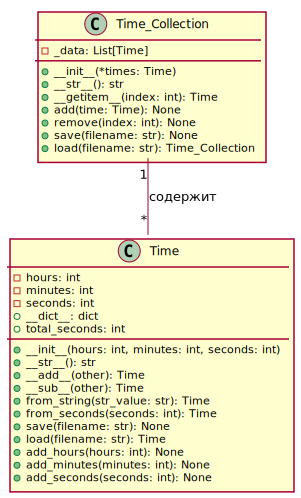

# Класс контейнер
## Вариант 4. Класс Time (Время)

Создайте класс-контейнер, который будет содержать набор объектов из предыдущей задачи.

```PYTHON
#Time.py
import json


class Time:
    """
    Класс для работы со временем.

    Атрибуты:
        hours (int): Часы.
        minutes (int): Минуты.
        seconds (int): Секунды.
    """

    def __init__(
            self, hours: int = 0, minutes: int = 0, seconds: int = 0
            ) -> None:
        self.hours: int = hours
        self.minutes: int = minutes
        self.seconds: int = seconds

    def __str__(self) -> str:
        """
        Метод для получения строкового представления объекта.
        """
        return f"{self.hours:02d}:{self.minutes:02d}:{self.seconds:02d}"

    def __add__(self, other):
        """
        Метод для сложения двух объектов класса Time.
        """
        total_seconds = self.total_seconds + other.total_seconds
        return Time.from_seconds(total_seconds)

    def __sub__(self, other):
        """
        Метод для вычитания двух объектов класса Time.
        """
        total_seconds = self.total_seconds - other.total_seconds
        return Time.from_seconds(total_seconds)
    
    @property
    def __dict__(self):
        return {"hours": self.hours,
                "minutes": self.minutes,
                "seconds": self.seconds}

    @property
    def total_seconds(self) -> int:
        """
        Свойство для получения общего количества секунд.
        """
        return self.hours * 3600 + self.minutes * 60 + self.seconds

    @classmethod
    def from_string(cls, str_value: str):
        """
        Метод класса для создания объекта на основании строки.
        """
        hours, minutes, seconds = map(int, str_value.split(":"))
        return cls(hours, minutes, seconds)

    @classmethod
    def from_seconds(cls, seconds: int):
        """
        Метод класса для создания объекта на основании количества секунд.
        """
        hours = seconds // 3600
        minutes = (seconds % 3600) // 60
        seconds = seconds % 60
        return cls(hours, minutes, seconds)

    def save(self, filename):
        with open(filename, "w") as f:
            f.write(json.dumps({
                "hours": self.hours,
                "minutes": self.minutes,
                "seconds": self.seconds}))

    @classmethod
    def load(cls, filename: str):
        """
        Метод класса для загрузки объекта из JSON-файла.
        """
        with open(filename, "r") as file:
            data = json.load(file)
        return cls(**data)

    def add_hours(self, hours: int) -> None:
        """
        Метод для добавления часов к объекту.
        """
        self.hours += hours

    def add_minutes(self, minutes: int) -> None:
        """
        Метод для добавления минут к объекту.
        """
        self.minutes += minutes

    def add_seconds(self, seconds: int) -> None:
        """
        Метод для добавления секунд к объекту.
        """
        self.seconds += seconds
```
```PYTHON
#Time_Collection.py
from Time import Time
import json


class Time_Collection:
    """
    Класс для хранения коллекции объектов Time.
    """

    def __init__(self, *times: Time) -> None:
        """
        Инициализация коллекции объектов Time.
        """
        self._data = []
        for time in times:
            self._data.append(time)

    def __str__(self) -> str:
        """
        Возвращает строковое представление коллекции объектов Time.
        """
        return "Times: {}".format([str(time) for time in self._data])

    def __getitem__(self, index: int) -> Time:
        """
        Возвращает объект Time по индексу.
        """
        return self._data[index]

    def add(self, time: Time) -> None:
        """
        Добавляет объект Time в коллекцию.
        """
        self._data.append(time)
        print(f"Добавлен элемент {time}")

    def remove(self, index: int) -> None:
        """
        Удаляет объект Time из коллекции по индексу.
        """
        self._data.pop(index)
        print(f"Удалён элемент {self._data[index]}")

    def save(self, filename: str) -> None:
        """
        Сохраняет коллекцию объектов Time в JSON-файл.
        """
        times_dict = [time.__dict__ for time in self._data]

        with open(filename, "w") as f:
            f.write(json.dumps({"Times": times_dict}))

    @classmethod
    def load(cls, filename: str):
        """
        Метод класса для загрузки объекта из JSON-файла.
        """
        with open(filename, "r") as file:
            data = json.load(file)
        times = [Time(**time_dict) for time_dict in data["Times"]]
        return cls(*times)
```
```PYTHON
#main_test.py
from unittest.mock import MagicMock, patch
from Time import Time
from Time_Collection import Time_Collection

# Создаем тестовые объекты Time
time1 = Time(1, 2, 3)
time2 = Time(4, 5, 6)


# Тестирование инициализации коллекции
def test_init():
    collection = Time_Collection(time1, time2)
    assert collection._data == [time1, time2]


# Тестирование метода __str__
def test_str():
    collection = Time_Collection(time1, time2)
    assert str(collection) == "Times: ['01:02:03', '04:05:06']"


# Тестирование метода __getitem__
def test_getitem():
    collection = Time_Collection(time1, time2)
    assert collection[0] == time1
    assert collection[1] == time2


# Тестирование метода add
def test_add():
    collection = Time_Collection()
    collection.add(time1)
    assert collection._data == [time1]


# Тестирование метода remove
def test_remove():
    collection = Time_Collection(time1, time2)
    collection.remove(0)
    assert collection._data == [time2]


# Тестирование метода save
@patch("builtins.open", new_callable=MagicMock)
def test_save(mock_open):
    collection = Time_Collection(time1, time2)
    collection.save("test.json")
    mock_open.assert_called_once_with("test.json", "w")


# Тестирование метода load
@patch("builtins.open", new_callable=MagicMock)
def test_load(mock_open):
    mock_open.return_value.__enter__.return_value.read.return_value = '' \
    '{"Times": [{"hours": 1, "minutes": 2, "seconds": 3},' \
    ' {"hours": 4, "minutes": 5, "seconds": 6}]}'

    collection = Time_Collection.load("test.json")
    assert collection._data[0].hours == time1.hours
    assert collection._data[0].minutes == time1.minutes
    assert collection._data[0].seconds == time1.seconds
    assert collection._data[1].hours == time2.hours
    assert collection._data[1].minutes == time2.minutes
    assert collection._data[1].seconds == time2.seconds

```

